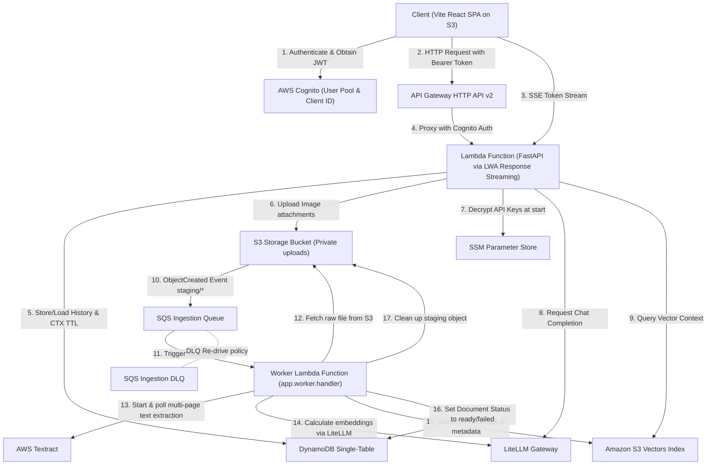
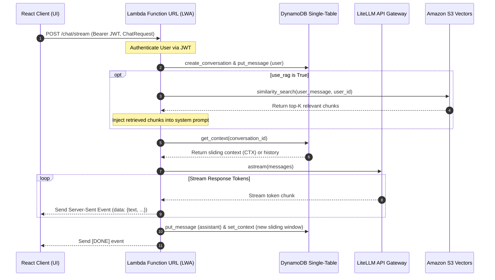
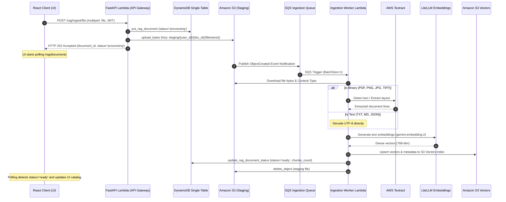

# Serverless Corporate Chatbot and RAG Platform on AWS

A production-grade, secure, and fully serverless corporate AI Chatbot and RAG (Retrieval-Augmented Generation) platform. The application is built using a decoupled Python FastAPI backend and a TypeScript React SPA frontend. Deployed in a single step using the AWS Serverless Application Model (SAM), the platform achieves serverless real-time streaming, enterprise authentication, and robust asynchronous document ingestion.

The architecture features Server-Sent Events (SSE) streaming through AWS Lambda Web Adapter, Cognito-based JWT authentication, private multimodal attachment storage in S3, and a decoupled event-driven RAG ingestion pipeline using Amazon SQS, AWS Textract, and native Amazon S3 Vectors for embedding storage and similarity search.

---

## Architecture Overview

The entire platform is built with a serverless-first philosophy, ensuring high scalability, zero idle compute charges, and minimal maintenance overhead.

- **Vite React SPA** is compiled into static assets and hosted in a public Amazon S3 bucket configured for static website hosting.
- **FastAPI Backend Application** runs inside an arm64 AWS Lambda function. Traffic is handled by API Gateway HTTP API v2 and Lambda Function URLs.
- **AWS Lambda Web Adapter (LWA)** serves as the execution wrapper on Lambda. In response streaming mode (`response_stream`), it bridges the FastAPI application's ASGI Server-Sent Events (SSE) directly to the client via Lambda Function URLs, bypassing API Gateway's lack of native streaming support.
- **AWS Cognito User Pool** provides secure user registration, sign-in, and session management. API Gateway uses a Cognito Authorizer to validate JWTs in the `Authorization` header.
- **Amazon SQS Ingestion Queue** handles background document processing. When a document is uploaded, it lands in the staging area of a private S3 bucket. This triggers an S3 Event Notification to SQS, decoupling the ingestion workload from the API request lifecycle.
- **Asynchronous Ingestion Worker** is an isolated Lambda function triggered by SQS. It downloads files, processes multi-page binaries using AWS Textract, splits and chunks text, computes embeddings via LiteLLM, indexes them in a native **Amazon S3 Vectors** store, and updates the document status in DynamoDB.

### System Architecture Diagrams

To understand the system structure and processing workflows, refer to the diagrams below:

#### High-Level System Architecture


### Logical Request and Data Flow (Interactive Visualization)



### AWS Services Used

| Service | Purpose | Billing Model |
|---|---|---|
| **API Gateway HTTP API v2** | Proxy entrypoint for standard REST API endpoints (GET/POST/PUT/DELETE) | PAY-PER-REQUEST (1M requests/month free tier) |
| **AWS Lambda (arm64 Graviton)** | Hosts both the FastAPI REST API and the SQS Ingestion Worker function | DURATION + INVOCATIONS (1M free requests/month) |
| **Amazon SQS & DLQ** | Decoupled queue for queuing heavy document parsing and embedding tasks | PAY-PER-REQUEST (1M free messages/month) |
| **Amazon S3 (Private Bucket)** | Secure storage for staging documents and presigned image attachments | SIZE + REQUESTS (5 GB free tier) |
| **Amazon S3 (Public Bucket)** | Hosts static compiled React, TypeScript, and TailwindCSS assets | SIZE + REQUESTS (5 GB free tier) |
| **Amazon S3 Vectors** | Fully native vector database index layered directly on top of Amazon S3 | SIZE + COMPUTE (Serverless, cheap high-density search) |
| **AWS Cognito** | Authenticates users, validates passwords, and issues JWT secure tokens | MAUs (50,000 Monthly Active Users free tier) |
| **AWS Textract** | Extracts layouts and text lines from multi-page PDFs, TIFFs, and PNGs | PER-PAGE (1,000 pages/month free tier) |
| **DynamoDB (PAY_PER_REQUEST)** | Stores conversation metadata, messages list, and context cache | PAY-PER-REQUEST (25 GB free storage) |
| **SSM Parameter Store** | Secure encrypted KMS storage of LiteLLM API credentials | FREE (Standard Parameters) |

---

## Key Features

- **Serverless response streaming (SSE)** — Real-time response token streaming using `astream` via Lambda Web Adapter and Lambda Function URLs, bypassing API Gateway timeouts.
- **Enterprise authentication (Cognito)** — Comprehensive user registration, account confirmation, secure sign-in, and JWT verification across endpoints.
- **Decoupled asynchronous RAG ingestion** — Multipart file uploads are immediately accepted with an HTTP `202` response. A background worker handles layout parsing (via Textract), text splitting, embedding generation, and vector index updates.
- **Fully native vector search** — Powered by Amazon S3 Vectors. Supports dense similarity searches scoped by `user_id` without external database servers.
- **Multimodal chat** — Upload PNG, JPEG, and WebP images (≤ 5MB) during conversations. Images are stored privately in S3, and served using expiring presigned URLs (1-hour TTL).
- **Persistent single-table DynamoDB history** — Highly optimized single-table DynamoDB design storing metadata, individual messages, and conversation context.
- **Sliding context window** — A dedicated DynamoDB `CTX` item stores a condensed sliding window of the last `N` messages for immediate context loading. It auto-expires via native DynamoDB TTL (default 1 hour).
- **Flexible LLM routing (LiteLLM)** — Supports multiple backend providers (OpenAI, Gemini, NVIDIA NIM, Anthropic) via SSM-secured parameter configurations, making the system model-agnostic.
- **Premium responsive frontend** — A beautiful dark-themed dashboard using shadcn/ui. Features real-time streaming displays, inline image attachments, dynamic RAG documents manager, loading spinners, and catalog auto-polling.

---

## Tech Stack

| Layer | Technology | Key Function |
|---|---|---|
| **Backend Core** | Python 3.12, FastAPI | Web API routing, dependency injection, and application logic |
| **Backend Tools** | LiteLLM, Boto3, Pydantic-Settings | LLM routing, AWS SDK, and environmental settings management |
| **Frontend Core** | TypeScript, React 18, Vite | UI component structure, type safety, and asset bundling |
| **Frontend Styling** | TailwindCSS, shadcn/ui, Lucide Icons | Responsive layout, theme configuration, and interactive controls |
| **Infrastructure** | AWS SAM, AWS CloudFormation | Infrastructure as Code (IaC) declaration and stack deployments |
| **Compute** | AWS Lambda, Lambda Web Adapter (LWA) | Serverless API runtime and serverless streaming adapter |
| **Database** | Amazon DynamoDB | Conversation history storage and context cache |
| **Vector DB** | Amazon S3 Vectors | Native serverless vector store for RAG embeddings |
| **Authentication** | AWS Cognito User Pools | Multi-tenant user login and JWT token validation |
| **Document Processing** | AWS Textract, SQS, SQS DLQ | Layout extraction, task queuing, and DLQ error fallback |

---

## Project Structure

```
chatbot-aws/
├── template.yaml            # AWS SAM IaC declaration (Lambda, API Gateway, DynamoDB, S3, SQS, IAM)
├── samconfig.toml           # Deployment configuration settings for SAM CLI
├── Makefile                 # Automation rules for deploying backend, frontend, and creating buckets
├── .env.example             # Template environment variables for local development
├── AGENTS.md                # Project standards, commands guide, and developer conventions
├── ARCHITECTURE.md          # Engineering log and architectural deep-dive
│
├── backend/
│   ├── pyproject.toml       # Python dependencies configuration (managed with uv)
│   ├── requirements.txt     # Flattened requirements generated for SAM docker building
│   │
│   └── app/
│       ├── main.py          # FastAPI application initialization & Mangum ASGI handler
│       ├── worker.py        # SQS event handler consuming staging files and indexing vectors
│       ├── settings.py      # Pydantic configuration settings loaded from env vars
│       ├── dependencies.py  # Dependency providers (DynamoDB, S3, SSM, LLM, Vector Store)
│       ├── logging_config.py# CloudWatch-compliant logging structure
│       │
│       ├── api/
│       │   └── routes.py    # Route definitions (chat, streaming, RAG ingestion, conversation histories)
│       │
│       ├── models/
│       │   └── schemas.py   # Pydantic data schemas for API requests & responses
│       │
│       ├── repositories/
│       │   └── conversation_repository.py  # DynamoDB single-table CRUD operations
│       │
│       ├── services/
│       │   ├── llm.py       # LiteLLM client for text and embedding models
│       │   ├── storage.py   # S3 file management and presigned URLs generator
│       │   ├── vector_store.py  # Amazon S3 Vectors native indexing and similarity search
│       │   ├── rag.py       # Document chunking, textract parsing, and embedding logic
│       │   └── prompt.py    # System prompt builder and chat history formatter
│       │
│       └── tests/
│           ├── conftest.py  # Test fixtures and database/S3/LLM stubs
│           └── test_rag.py  # Integration tests for ingestion worker and search
│
└── frontend/
    ├── package.json         # Node dependency definitions (managed with pnpm)
    ├── vite.config.ts       # Vite build configurations and environmental proxies
    ├── tailwind.config.js   # Tailwind layout and visual design variables
    │
    └── src/
        ├── main.tsx         # Frontend React bootstrap entrypoint
        ├── App.tsx          # Dashboard, chat stream rendering, RAG controls, and settings panel
        ├── index.css        # Core style injection and Tailwind imports
        │
        ├── components/      # UI components (Buttons, Inputs, Dialogs, Cards, Tables)
        ├── types/           # TypeScript interfaces for API payloads and entities
        │
        └── services/
            ├── auth.ts      # Cognito integration wrapper for login, confirm, and signup
            └── api.ts       # HTTP client endpoints and real-time SSE stream reader
```

---

## Logic Flows

### Real-Time Response Streaming (`POST /chat/stream`)

The platform implements response streaming using the AWS Lambda Web Adapter. This bypasses the typical API Gateway 30-second execution limit and eliminates client-side polling.



### Event-Driven Asynchronous Ingestion & Vector Indexing

To support large, multi-page documents (PDFs, Images, Text files) without hitting API Gateway timeouts, document ingestion runs asynchronously via an S3-SQS-Worker pattern.



### DynamoDB Single-Table Schema

All persistent application data resides in a single DynamoDB table. Access patterns are determined by the Partition Key (`pk`) and Sort Key (`sk`), with a secondary Global Secondary Index (`UserConversationsIndexV2`) for user-level lookups.

| Item Type | Partition Key (`pk`) | Sort Key (`sk`) | Attributes |
|---|---|---|---|
| **Conversation Metadata** | `CONV#<conversation_id>` | `META` | `user_id`, `name`, `created_at`, `updated_at` |
| **Conversation Message** | `CONV#<conversation_id>` | `MSG#<timestamp>#<message_id>` | `role`, `content`, `attachment` (metadata map), `created_at` |
| **Sliding Context Window** | `CONV#<conversation_id>` | `CTX` | `messages` (JSON list of last N interactions), `ttl` (epoch epoch), `updated_at` |
| **RAG Document Catalog** | `USER#<user_id>` | `DOC#<document_id>` | `filename`, `chunks_ingested`, `status` (`processing`/`ready`/`failed`), `created_at`, `updated_at` |

---

## Installation & Setup

### Prerequisites

- **Python 3.12+** & **uv** package manager.
- **Node.js 18+** & **pnpm** package manager.
- **AWS CLI v2** & **AWS SAM CLI** (configured with credentials).
- **Docker** (required locally if running `sam build` or testing containers).

### Local Backend Development

Navigate to the project root directory and follow these steps to configure the FastAPI application.

```bash
# 1. Access the backend workspace
cd backend

# 2. Synchronize Python virtual environment and dependencies using uv
uv sync

# 3. Configure local environment variables
cp ../.env.example .env
# Open .env and add your AWS Credentials, and LITELLM / Gemini API Keys.
# To run fully local without AWS, set DYNAMODB_ENDPOINT_URL and S3_ENDPOINT_URL.

# 4. Launch the local FastAPI Uvicorn server
uv run uvicorn app.main:app --reload --port 8080
```

The FastAPI REST API will be available at `http://localhost:8080`. The interactive Swagger UI documentation is accessible at `http://localhost:8080/docs`.

### Local Frontend Development

Configure and launch the React TypeScript frontend.

```bash
# 1. Access the frontend workspace
cd frontend

# 2. Install node dependencies using pnpm
pnpm install

# 3. Configure local frontend environment variables
cp .env.example .env
# Edit .env and match the Cognito credentials generated from your deployed AWS stack,
# or point VITE_API_BASE_URL to your local backend (http://localhost:8080).

# 4. Start the Vite React development server
pnpm dev
```

The Vite dev server will host the application at `http://localhost:3000`.

### Running Tests

Execute the comprehensive integration test suite.

```bash
cd backend
uv run pytest tests/ -v
```

---

## Deployment

Deploying the stack is automated via the root `Makefile`. The deployment is split into the Backend (infrastructure, worker, databases) and Frontend (Vite build, assets syncing to S3 website bucket).

### 1. Store API Secrets in AWS SSM

Securely store your LiteLLM model provider key in AWS Systems Manager (SSM) Parameter Store. This ensures secrets are decrypted at cold start and never stored as plaintext environment variables.

```bash
aws ssm put-parameter \
  --name "/chatbot/litellm_api_key" \
  --type "SecureString" \
  --value "your-api-key" \
  --overwrite

aws ssm put-parameter \
  --name "/chatbot/litellm_vision_api_key" \
  --type "SecureString" \
  --value "your-vision-api-key" \
  --overwrite
```

### 2. Deploy Backend & Cloud Infrastructure

The backend build packages your Python modules, exports the `requirements.txt` file, builds the container wrapper, and invokes AWS SAM to provision all AWS resources.

```bash
# Deploys backend and prints SAM Stack Outputs (Cognito IDs, FunctionUrl, API Gateway)
make deploy-backend
```

### 3. Deploy Frontend Assets

The frontend compilation fetches active CloudFormation outputs (Cognito Client ID, User Pool ID, and Lambda Function URL) from the active backend stack, injects them as build-time environment variables into Vite, builds the application, and uploads them to the public static S3 bucket.

```bash
# Bundles React production code and syncs to your static S3 Bucket
make deploy-frontend
```

### 4. Direct Full-Stack Deployment

To deploy both components sequentially in a single command, run:

```bash
make deploy-all
```

---

## Usage Examples

Below are standard API integration command examples for developers interacting with the API or writing external clients.

### 1. Retrieve Deployed API Base URLs

After a successful SAM deployment, run the following commands to retrieve your live endpoints:

```bash
# Fetch live FastAPI Lambda streaming Function URL
aws cloudformation describe-stacks \
  --stack-name chat \
  --query "Stacks[0].Outputs[?OutputKey=='FunctionUrl'].OutputValue" \
  --output text

# Fetch live Static Web UI hosting URL
aws cloudformation describe-stacks \
  --stack-name chat \
  --query "Stacks[0].Outputs[?OutputKey=='FrontendUrl'].OutputValue" \
  --output text
```

### 2. Verify Health Check

Verify connection status without authentication.

```bash
curl -X GET https://<api-id>.execute-api.<region>.amazonaws.com/health
# {"status":"ok"}
```

### 3. Send a Secure Chat Message

Authentication is required for all chat routes. Once authenticated via Cognito, pass the JWT token inside the `Authorization` header.

```bash
curl -X POST https://<function-url-id>.lambda-url.<region>.on.aws/chat \
  -H "Authorization: Bearer <your_cognito_jwt_token>" \
  -H "Content-Type: application/json" \
  -d '{
    "message": "What are the benefits of event-driven architectures?",
    "use_rag": false
  }'
```

Response:
```json
{
  "conversation_id": "4a71de2e-db62-411a-82ee-0524cb1da334",
  "user_message_id": "8bb31980-dfde-4122-b5e1-7d121bc823ef",
  "assistant_message_id": "c1f7b8bb-0294-43ea-bc3c-c6df67cc29e9",
  "assistant_message": "Event-driven architectures enable loose coupling, scalability, and improved responsiveness...",
  "created_at": "2026-05-26T11:03:00Z",
  "error": null
}
```

### 4. Stream Real-Time Server-Sent Events

For streaming, connect directly to the streaming Lambda Function URL using Server-Sent Events.

```bash
curl -N -X POST https://<function-url-id>.lambda-url.<region>.on.aws/chat/stream \
  -H "Authorization: Bearer <your_cognito_jwt_token>" \
  -H "Content-Type: application/json" \
  -d '{
    "message": "Explain quantum computing in one sentence.",
    "conversation_id": "4a71de2e-db62-411a-82ee-0524cb1da334"
  }'
```

Output:
```text
data: {"text": "Quantum", "conversation_id": "4a71de2e-db62-...", "assistant_message_id": "...", "user_message_id": "..."}

data: {"text": " computing", "conversation_id": "4a71de2e-db62-...", "assistant_message_id": "...", "user_message_id": "..."}

...

data: [DONE]
```

### 5. Ingest a Document File for Asynchronous RAG

Upload a physical binary document (PDF, PNG, JPEG, TIFF) up to 20MB. The API returns an immediate `202 Accepted` while the SQS worker processes the file in the background.

```bash
curl -X POST https://<function-url-id>.lambda-url.<region>.on.aws/rag/ingest/file \
  -H "Authorization: Bearer <your_cognito_jwt_token>" \
  -F "file=@financial_report.pdf"
```

Response:
```json
{
  "status": "processing",
  "filename": "financial_report.pdf",
  "document_id": "99f8166c-5b68-4521-a3f2-1f4886b5da49",
  "chunks_ingested": 0
}
```

### 6. Query Ingested Documents Status

Poll or fetch the RAG catalog to check the status of your uploaded document.

```bash
curl -X GET https://<function-url-id>.lambda-url.<region>.on.aws/rag/documents \
  -H "Authorization: Bearer <your_cognito_jwt_token>"
```

Response:
```json
[
  {
    "document_id": "99f8166c-5b68-4521-a3f2-1f4886b5da49",
    "filename": "financial_report.pdf",
    "source_doc": "financial_report.pdf",
    "chunks_ingested": 18,
    "status": "ready",
    "created_at": "2026-05-26T10:45:00Z",
    "updated_at": "2026-05-26T10:46:12Z"
  }
]
```

---

## Configuration Reference

All application parameters are loaded by `pydantic-settings` from environment variables (or `.env` files locally). When deployed to AWS, parameters are injected by CloudFormation via `template.yaml`.

| Variable | Default Value | Description |
|---|---|---|
| **AWS_REGION** | `us-east-1` | Active AWS region (injected automatically in Lambda) |
| **DYNAMODB_TABLE_NAME** | `chatbot` | Main DynamoDB single-table name |
| **DYNAMODB_ENDPOINT_URL** | _None_ | Local endpoint override for DynamoDB Local |
| **S3_BUCKET_NAME** | `chatbot-uploads` | S3 bucket name for staging documents and attachments |
| **S3_ENDPOINT_URL** | _None_ | Local endpoint override for S3 (e.g. Minio) |
| **S3_FORCE_PATH_STYLE** | `false` | Enable path-style S3 URLs (required for Minio) |
| **LITELLM_MODEL** | `openai/gpt-oss-120b` | Target core LLM model router string |
| **LITELLM_VISION_MODEL** | `gemini/gemini-3.1-flash-lite` | Vision model used for multimodal image chats |
| **LITELLM_EMBEDDING_MODEL** | `gemini/gemini-embedding-2` | Embedding model used for RAG indexing |
| **S3_VECTOR_BUCKET_NAME**| `chatbot-vectors-prod` | Dedicated Amazon S3 Vectors Bucket |
| **S3_VECTOR_INDEX_NAME** | `enterprise-kb` | Active Amazon S3 Vectors search index |
| **EMBEDDING_DIMENSION** | `768` | Dimension count of the dense vector embeddings |
| **RAG_TOP_K** | `3` | Total retrieved text blocks injected into system prompts |
| **RAG_CHUNK_SIZE** | `800` | Target characters length per text chunk |
| **RAG_CHUNK_OVERLAP** | `80` | Overlap character length between neighboring chunks |
| **CONTEXT_TTL_SECONDS** | `3600` | Expiration lifetime of the DynamoDB `CTX` cache item |
| **MAX_HISTORY_MESSAGES** | `10` | Maximum message records cached in the sliding context window |
| **MAX_IMAGE_BYTES** | `5242880` | Max file upload limit for image attachments (5 MB) |
| **ALLOWED_IMAGE_MIME_TYPES**| `image/png,image/jpeg,image/webp` | Accepted mime-types for multimodal analysis |
| **LOG_LEVEL** | `INFO` | Level of logging output (DEBUG, INFO, WARNING, ERROR) |
| **COGNITO_USER_POOL_ID** | _None_ | AWS Cognito User Pool identifier |
| **COGNITO_CLIENT_ID** | _None_ | AWS Cognito User Pool Client application ID |
