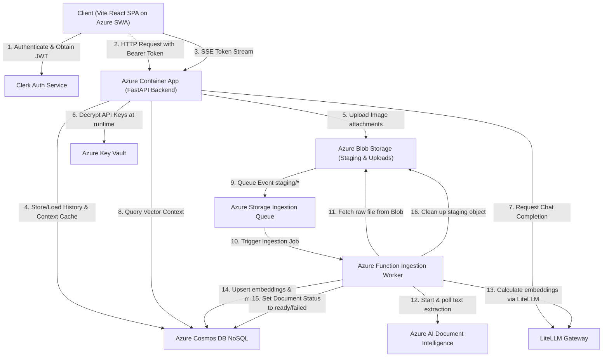
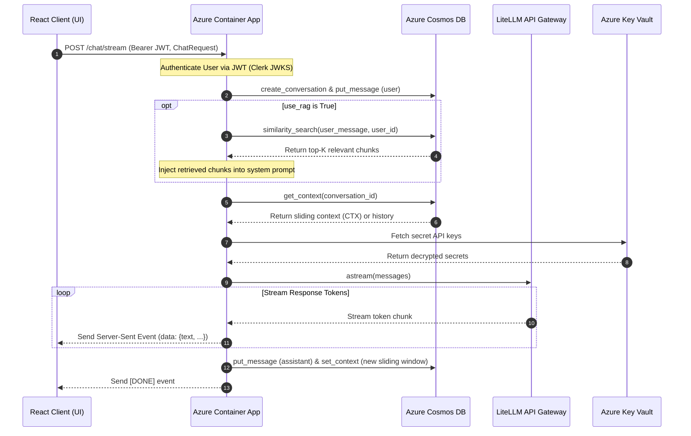

# Serverless Chatbot and RAG Platform on Azure

> [!NOTE]
> **Disclaimer/PoC Status**: This repository is a Proof of Concept (PoC) to port the [chatbot-aws](https://github.com/Hari31416/chatbot-aws) repository (which utilizes AWS) to Azure, based on the codebase at commit hash [`6426de32e2a25cc4bc56e5d66bd9698642489e55`](https://github.com/Hari31416/chatbot-aws/tree/6426de32e2a25cc4bc56e5d66bd9698642489e55). Please note that this Azure-based stack is not actively updated (except potentially for documentation). All new features, bug fixes, and active developments will be committed directly to the parent [chatbot-aws](https://github.com/Hari31416/chatbot-aws) repository. You are free to use, modify, and reference this Azure port as you see fit.

A production-grade, secure, and fully serverless AI Chatbot and RAG (Retrieval-Augmented Generation) platform. The application is built using a decoupled Python FastAPI backend and a TypeScript React SPA frontend. Deployed natively on Azure, the platform achieves serverless real-time streaming, modern user authentication, and robust asynchronous document ingestion.

The architecture features Server-Sent Events (SSE) streaming through Azure Container Apps, Clerk-based JWT authentication, private multimodal attachment storage in Azure Blob Storage, and a decoupled event-driven RAG ingestion pipeline using Azure Storage Queues, Azure AI Document Intelligence, and native Cosmos DB for conversation history and vector storage.

---

## Architecture Overview

The entire platform is built with a serverless-first philosophy, ensuring high scalability, zero idle compute charges, and minimal maintenance overhead.

- **Vite React SPA** is compiled into static assets and hosted seamlessly on **Azure Static Web Apps (SWA)**.
- **FastAPI Backend Application** runs inside an auto-scaling **Azure Container App (ACA)**. Traffic is routed securely through a public ingress endpoint, supporting serverless real-time SSE streaming.
- **System-Assigned Managed Identity** handles permissions automatically, allowing Azure Container Apps and Azure Functions to authenticate with Azure Key Vault, Azure Blob Storage, and Azure Cosmos DB without hardcoded connection secrets.
- **Clerk Authentication** provides user identity management, registration, sign-in, and session management on the frontend. The backend validates Clerk session JWTs dynamically against Clerk's JWKS endpoint.
- **Azure Storage Queues Ingestion Queue** handles background document processing. When a document is uploaded, it lands in the staging area of an Azure Blob Storage container. This triggers a storage queue message, decoupling the ingestion workload from the API request lifecycle.
- **Asynchronous Ingestion Worker** is an isolated **Azure Function App** triggered by the Ingestion Queue. It downloads files, processes multi-page binaries using **Azure AI Document Intelligence**, splits and chunks text, computes embeddings via LiteLLM, indexes them in a native **Cosmos DB** container, and updates the document status.

### High-Level System Architecture


### Logical Request and Data Flow (Interactive Visualization)



### Azure Services Used

| Service                                | Purpose                                                                  | Billing Model                      |
| -------------------------------------- | ------------------------------------------------------------------------ | ---------------------------------- |
| **Azure Static Web Apps**              | Hosts static compiled React, TypeScript, and CSS assets                  | Free SKU / Pay-Per-Request         |
| **Azure Container Apps**               | Hosts the FastAPI REST API, scaling down to 0 instances when idle        | Serverless Consumption             |
| **Azure Functions (Linux)**            | Runs the background ingestion queue worker triggered by Storage Queues   | Serverless Consumption Plan        |
| **Azure Storage Queues**               | Decoupled queue for queuing heavy document parsing and embedding tasks   | Pay-Per-Transactions               |
| **Azure Blob Storage**                 | Secure storage for staging documents and presigned image attachments     | Pay-Per-Space + Requests           |
| **Azure Cosmos DB**                    | Stores conversation history, metadata, and RAG vector embeddings         | Pay-Per-Request (Serverless)       |
| **Azure AI Document Intelligence**     | Extracts layouts and text lines from multi-page PDFs, TIFFs, and PNGs    | Pay-Per-Page (Free tier available) |
| **Azure Key Vault**                    | Secure encrypted secret store of model API keys and gateway credentials  | Pay-Per-Transaction                |
| **Azure Log Analytics & App Insights** | Centrally logs events, monitors server performance, and tracks API usage | Pay-Per-Ingestion (Azure Monitor)  |

---

## Key Features

- **Serverless response streaming (SSE)** — Real-time response token streaming using `astream` via Azure Container Apps built-in HTTP ingress stream support.
- **Modern User Authentication (Clerk)** — Frontend sign-up, sign-in, and profile management backed by secure JWKS validation on FastAPI endpoints.
- **Decoupled asynchronous RAG ingestion** — Multipart file uploads are immediately accepted with an HTTP `202` response. A background Azure Function worker handles layout parsing (via Document Intelligence), text splitting, embedding generation, and vector index updates.
- **Fully native vector search** — Integrated directly into Azure Cosmos DB. Supports dense similarity searches scoped by `user_id` without external database servers.
- **Multimodal chat** — Upload PNG, JPEG, and WebP images (≤ 5MB) during conversations. Images are stored privately in Blob Storage, and served using expiring SAS URLs (1-hour TTL).
- **Persistent Cosmos DB history** — Highly optimized container design storing metadata, individual messages, and conversation context.
- **Sliding context window** — A dedicated Cosmos DB `CTX` item stores a condensed sliding window of the last `N` messages for immediate context loading. It auto-expires via native Cosmos DB TTL.
- **Flexible LLM routing (LiteLLM)** — Supports multiple backend providers (OpenAI, Gemini, NVIDIA NIM, Anthropic) via Key Vault-secured secret configurations, making the system model-agnostic.
- **Premium responsive frontend** — A beautiful dark-themed dashboard using shadcn/ui. Features real-time streaming displays, inline image attachments, dynamic RAG documents manager, loading spinners, and catalog auto-polling.

---

## Tech Stack

| Layer                   | Technology                                     | Key Function                                                          |
| ----------------------- | ---------------------------------------------- | --------------------------------------------------------------------- |
| **Backend Core**        | Python 3.12, FastAPI                           | Web API routing, dependency injection, and application logic          |
| **Backend Tools**       | LiteLLM, Azure SDK, Pydantic-Settings          | LLM routing, Azure API Clients, and environmental settings            |
| **Frontend Core**       | TypeScript, React 18, Vite                     | UI component structure, type safety, and asset bundling               |
| **Frontend Styling**    | TailwindCSS, shadcn/ui, Lucide Icons           | Responsive layout, theme configuration, and interactive controls      |
| **Infrastructure**      | Azure Bicep                                    | Infrastructure as Code (IaC) declaration and subscription deployments |
| **Compute**             | Azure Container Apps, Azure Functions          | Serverless API runtime and serverless queue worker runtime            |
| **Database**            | Azure Cosmos DB                                | Conversation history storage and context cache                        |
| **Vector DB**           | Azure Cosmos DB Vectors                        | Integrated serverless vector store for RAG embeddings                 |
| **Authentication**      | Clerk Auth                                     | Modern user sign-in/up and JWKS token verification                    |
| **Document Processing** | Azure AI Document Intelligence, Storage Queues | Layout extraction, task queuing, and OCR                              |

---

## Project Structure

```txt
chatbot-azure/
├── infra/
│   ├── main.bicep               # Subscription-level Bicep orchestrator
│   ├── modules/                 # Modularized components
│   │   ├── container-apps.bicep # Azure Container Apps + ACR environment
│   │   ├── cosmos.bicep         # Cosmos DB Account, DB, and containers
│   │   ├── document-intelligence.bicep # Azure AI Document Intelligence resource
│   │   ├── functions.bicep      # Azure Function host and settings
│   │   ├── keyvault.bicep       # Secrets storage and role assignments
│   │   ├── monitoring.bicep     # Log Analytics + Application Insights
│   │   ├── static-web-app.bicep # Azure Static Web Apps static host
│   │   └── storage.bicep        # Blob Containers + Storage Queues setup
│
├── Makefile                 # Automation rules for deploying backend, frontend, and infra
├── .env.example             # Template environment variables for local development
├── AGENTS.md                # Project standards, commands guide, and developer conventions
│
├── backend/
│   ├── pyproject.toml       # Python dependencies configuration (managed with uv)
│   ├── Dockerfile           # High-performance uv container recipe
│   ├── .dockerignore        # Container builder exclusions
│   ├── run.sh               # Local backend runtime script wrapper
│   │
│   └── app/
│       ├── main.py          # FastAPI application initialization
│       ├── settings.py      # Pydantic configuration settings loaded from env vars
│       ├── dependencies.py  # Dependency providers (Cosmos, Storage, KeyVault, LLM)
│       ├── logging_config.py# Structured JSON logging for Log Analytics
│       │
│       ├── api/
│       │   └── routes.py    # Route definitions (chat, streaming, RAG ingestion, history)
│       │
│       ├── models/
│       │   └── schemas.py   # Pydantic data schemas for API requests & responses
│       │
│       ├── repositories/
│       │   └── conversation_repository.py  # Cosmos DB NoSQL CRUD operations
│       │
│       ├── services/
│       │   ├── llm.py       # LiteLLM client for text and embedding models
│       │   ├── storage.py   # Blob Storage container and SAS SAS URL generator
│       │   ├── vector_store.py  # Cosmos DB vector indexing and similarity search
│       │   ├── rag.py       # Document chunking and Doc Intelligence parsing
│       │   └── prompt.py    # System prompt builder and chat history formatter
│       │
│       └── tests/
│           ├── conftest.py  # Test fixtures and database/Blob/LLM stubs
│           └── test_rag.py  # Integration tests for ingestion worker and search
│
└── frontend/
    ├── package.json         # Node dependency definitions (managed with pnpm)
    ├── vite.config.ts       # Vite build configurations and environmental proxies
    ├── staticwebapp.config.json # SWA client fallback routing and security headers
    │
    └── src/
        ├── main.tsx         # Frontend React bootstrap entrypoint
        ├── App.tsx          # Dashboard, chat stream rendering, RAG controls, and settings panel
        ├── index.css        # Core style injection and Tailwind imports
        │
        ├── components/      # UI components (Buttons, Inputs, Dialogs, Cards, Tables)
        ├── types/           # TypeScript interfaces for API payloads and entities
        │
        └── services/
            ├── auth.ts      # Clerk session token bridge for API requests
            └── api.ts       # HTTP client endpoints and real-time SSE stream reader
```

---

## Logic Flows

### Real-Time Response Streaming (`POST /chat/stream`)

The platform implements response streaming using Azure Container Apps ingress. This bypasses typical server timeouts and eliminates client-side polling.



---

## Local Development

Follow these steps to run the application components in your local development environment.

### Prerequisites

Ensure you have the following tools installed:

- Python 3.12+ (managed with `uv`)
- Node.js 18+ and `pnpm` (version 9+)
- Docker (optional, required for local Container App simulation)
- Azure Functions Core Tools (v4+)

### Local Backend Development

Initialize and start the FastAPI backend service.

```bash
# 1. Access the backend workspace
cd backend

# 2. Setup the virtual environment and install dependencies
uv venv
uv pip install -r requirements.txt

# 3. Configure local environment variables
cp .env.example .env
# Edit .env and supply your local Cosmos DB emulator/service keys
# and Clerk config variables (CLERK_ISSUER, CLERK_AUTHORIZED_PARTIES)

# 4. Launch the local FastAPI Uvicorn server
uv run uvicorn app.main:app --reload --port 8080
```

The FastAPI REST API will be available at `http://localhost:8080`. The interactive Swagger UI documentation is accessible at `http://localhost:8080/docs`.

### Local Frontend Development

Configure and launch the React TypeScript frontend.

```bash
# 1. Access the frontend workspace
cd frontend

# 2. Install node dependencies using pnpm
pnpm install

# 3. Configure local frontend environment variables
cp .env.example .env
# Edit .env and set your Clerk publishable key (VITE_CLERK_PUBLISHABLE_KEY),
# or point VITE_API_BASE_URL to your local backend (http://localhost:8080).

# 4. Start the Vite React development server
pnpm dev
```

The Vite dev server will host the application at `http://localhost:3000`.

### Running Tests

Execute the comprehensive integration test suite.

```bash
cd backend
uv run pytest tests/ -v
```

---

## Deployment

Deploying the stack is automated via the root `Makefile`.

### 1. Store Secrets in Azure Key Vault

Store your LiteLLM model provider keys in your newly deployed Azure Key Vault to ensure secrets are decrypted at runtime.

```bash
az keyvault secret set \
  --vault-name "kv-chatbot-dev" \
  --name "litellm-api-key" \
  --value "your-api-key"

az keyvault secret set \
  --vault-name "kv-chatbot-dev" \
  --name "litellm-vision-api-key" \
  --value "your-vision-api-key"
```

### 2. Deploy Infrastructure, Backend, and Frontend

Use the unified Makefile to provision all infrastructure, build containers, and deploy:

```bash
# Step 1: Deploy Subscriptions Infrastructure via Bicep
make deploy-infra

# Step 2: Build backend container, push to ACR and update Container App
make deploy-backend

# Step 3: Compile React, inject endpoints, and deploy to Static Web App
make deploy-frontend

# Or deploy everything in one sequence:
make deploy-all
```

---

## Usage Examples

Below are standard API integration command examples for developers interacting with the API or writing external clients.

### 1. Verify Health Check

Verify connection status without authentication.

```bash
curl -X GET https://chatbot-backend.<unique-identifier>.<region>.azurecontainerapps.io/health
# {"status":"ok"}
```

### 2. Send a Secure Chat Message

Authentication is required for all chat routes. Once authenticated via Clerk, pass the session JWT token inside the `Authorization` header.

```bash
curl -X POST https://chatbot-backend.<unique-identifier>.<region>.azurecontainerapps.io/chat \
  -H "Authorization: Bearer <your_clerk_jwt_token>" \
  -H "Content-Type: application/json" \
  -d '{
    "message": "What are the benefits of event-driven architectures?",
    "use_rag": false
  }'
```

### 3. Stream Real-Time Server-Sent Events

For streaming, connect directly to the streaming Container App endpoint using Server-Sent Events.

```bash
curl -N -X POST https://chatbot-backend.<unique-identifier>.<region>.azurecontainerapps.io/chat/stream \
  -H "Authorization: Bearer <your_clerk_jwt_token>" \
  -H "Content-Type: application/json" \
  -d '{
    "message": "Explain quantum computing in one sentence.",
    "conversation_id": "4a71de2e-db62-411a-82ee-0524cb1da334"
  }'
```

---

## Configuration Reference

All application parameters are loaded by `pydantic-settings` from environment variables (or `.env` files locally).

| Variable                                 | Default Value                  | Description                                                            |
| ---------------------------------------- | ------------------------------ | ---------------------------------------------------------------------- |
| **AZURE_STORAGE_CONNECTION_STRING**      | _None_                         | Blob Storage connection string (used locally)                          |
| **AZURE_STORAGE_ACCOUNT_NAME**           | _None_                         | Storage account name (used dynamically under Managed Identity)         |
| **AZURE_STORAGE_CONTAINER_NAME**         | `uploads`                      | Secure blob container for chat image uploads                           |
| **COSMOS_ENDPOINT**                      | _None_                         | Endpoint URL for Cosmos DB API connection                              |
| **COSMOS_KEY**                           | _None_                         | Account credentials key for Cosmos DB (local development)              |
| **COSMOS_DATABASE_NAME**                 | `chatbot`                      | Target database within the Cosmos DB Account                           |
| **COSMOS_CONTAINER_NAME**                | `conversations`                | Target NoSQL storage container for messaging records                   |
| **AZURE_KEYVAULT_NAME**                  | _None_                         | Vault name hosting LiteLLM integration secrets                         |
| **AZURE_INGESTION_QUEUE_NAME**           | `ingestion-queue`              | Storage queue for asynchronous processing coordination                 |
| **AZURE_DOCUMENT_INTELLIGENCE_ENDPOINT** | _None_                         | AI Document Intelligence endpoint for OCR layouts                      |
| **AZURE_DOCUMENT_INTELLIGENCE_KEY**      | _None_                         | Credentials API key for Document Intelligence                          |
| **CLERK_ISSUER**                         | _None_                         | Clerk instance Frontend API URL (OIDC Issuer)                          |
| **CLERK_JWKS_URL**                       | _None_                         | Explicit Clerk JWKS URL (optional, derived if not set)                 |
| **CLERK_AUTHORIZED_PARTIES**             | _None_                         | Comma-separated list of allowed client origin origins (e.g. localhost) |
| **CLERK_SECRET_KEY**                     | _None_                         | Clerk backend API secret key (stored in Key Vault in prod)             |
| **LITELLM_MODEL**                        | `gpt-4o-mini`                  | Core LLM model router string                                           |
| **LITELLM_VISION_MODEL**                 | `gemini/gemini-3.1-flash-lite` | Vision model used for multimodal image chats                           |
| **LITELLM_EMBEDDING_MODEL**              | `gemini/gemini-embedding-2`    | Embedding model used for RAG indexing                                  |
| **EMBEDDING_DIMENSION**                  | `768`                          | Dimension count of the dense vector embeddings                         |
| **RAG_TOP_K**                            | `3`                            | Total retrieved text blocks injected into system prompts               |
| **RAG_CHUNK_SIZE**                       | `800`                          | Target characters length per text chunk                                |
| **RAG_CHUNK_OVERLAP**                    | `80`                           | Overlap character length between neighboring chunks                    |
| **CONTEXT_TTL_SECONDS**                  | `3600`                         | Expiration lifetime of the Cosmos DB `CTX` cache item                  |
| **MAX_HISTORY_MESSAGES**                 | `10`                           | Maximum message records cached in the sliding context window           |
| **LOG_FORMAT**                           | `text`                         | Logger formatting mode (`text` or `json`)                              |
| **LOG_LEVEL**                            | `INFO`                         | Level of logging output (DEBUG, INFO, WARNING, ERROR)                  |
