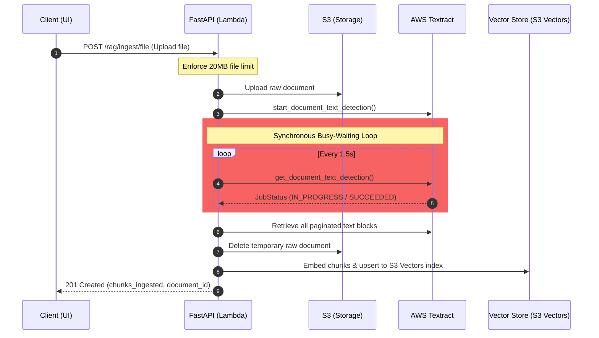
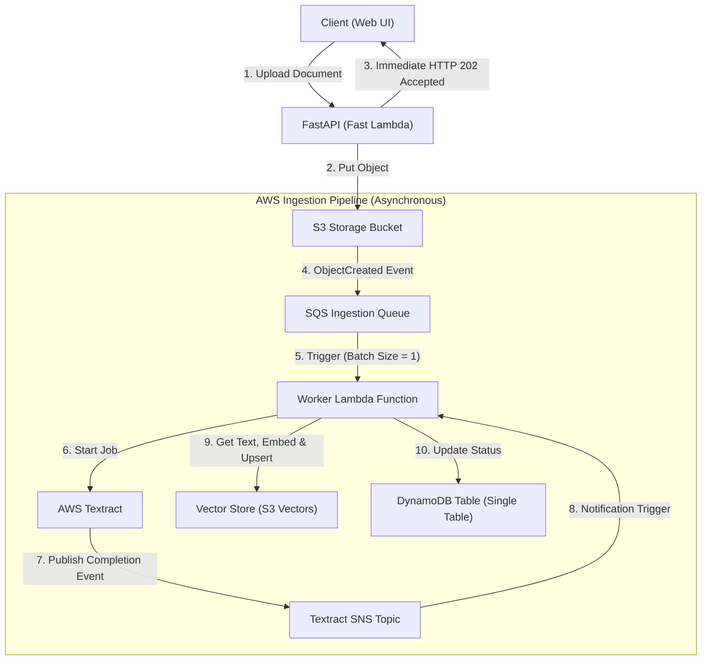

# Event-Driven Asynchronous Ingestion & Pub-Sub Architecture

This document evaluates the current synchronous document ingestion architecture and proposes a production-grade, event-driven asynchronous architecture using AWS native messaging and queueing services (SQS, SNS, and S3 Event Notifications).

---

## 1. Current Architecture & Key Bottlenecks

Currently, multi-page and binary documents (such as PDFs, PNGs, and JPEGs) are processed synchronously in the API request/response cycle when calling `/rag/ingest/file`.



### Critical Limitations:

1. **Lambda & API Gateway Timeouts:** The `ChatbotBackendFunction` in `template.yaml` has a hard timeout of **30 seconds**. If a document has dozens of pages, Textract parsing + embedding generation + single-table vector indexing will exceed 30 seconds, causing API Gateway to abort the connection with a `504 Gateway Timeout` or `502 Bad Gateway`.
2. **High Billing Cost (Busy-Waiting):** AWS Lambda charges dynamically for computation duration. Holding a Lambda function active while polling Textract (which takes anywhere from 5 seconds to 3 minutes) leads to a significant waste of budget on idle CPU sleep time.
3. **Concurrency Exhaustion:** Long-running requests exhaust API Gateway and Lambda concurrent execution limits, potentially throttling normal chat requests (`/chat` or `/chat/stream`) for other users.
4. **Lack of Retries & DLQ:** If the vector store goes down momentarily during embedding upserts, the entire ingestion job fails, requiring the user to re-upload the file.

---

## 2. Proposed Event-Driven Architecture

By introducing a decoupled, queue-centric publisher-subscriber workflow, the user-facing API receives an immediate `202 Accepted` response, and processing is delegated entirely to background worker processes.



### Decoupled Logic Flow:

1. **Initiate Upload:** The user uploads a file to `/rag/ingest/file`.
2. **Immediate Acknowledgment:** FastAPI uploads the document to a private S3 staging bucket (e.g. `chatbot-uploads-.../staging/`) and returns an immediate response with a `202 Accepted` status along with a `document_id` and status of `"processing"`.
3. **Queue Notification:** S3 triggers an event notification on file landing, publishing a message into an **Amazon SQS Ingestion Queue**.
4. **Trigger Ingest Worker:** An ingestion **Worker Lambda** consumes the message from SQS, calls `textract.start_document_text_detection` pointing to the S3 object, and registers an **Amazon SNS Topic** to receive completion notifications.
5. **Textract Background Processing:** Textract processes the file completely offline.
6. **Processing Complete:** Textract publishes a "Succeeded" or "Failed" payload to the **SNS Topic**, which invokes the **Worker Lambda** (Step 2).
7. **Embed and Store:** The Worker retrieves the blocks from Textract, splits them into logical chunks, calculates embeddings, writes them to S3 Vectors, and updates the DynamoDB table metadata status from `"processing"` to `"ready"`.

---

## 3. Infrastructure Configuration changes (AWS SAM)

To implement this architecture in `template.yaml`, the following resources are added:

### A. SQS Ingestion Queue with Dead Letter Queue (DLQ)

```yaml
# Dead Letter Queue for failed ingestion runs
IngestionDLQ:
  Type: AWS::SQS::Queue
  Properties:
    QueueName: !Sub chatbot-ingestion-dlq-${Environment}
    MessageRetentionPeriod: 1209600 # 14 days

# Main Ingestion Queue
IngestionQueue:
  Type: AWS::SQS::Queue
  Properties:
    QueueName: !Sub chatbot-ingestion-queue-${Environment}
    VisibilityTimeout: 180 # Must be >= Ingestion Worker Timeout
    RedrivePolicy:
      deadLetterTargetArn: !GetAtt IngestionDLQ.Arn
      maxReceiveCount: 3 # Retry failed messages 3 times before sending to DLQ
```

### B. Ingestion Worker Lambda Function

```yaml
ChatbotIngestionWorkerFunction:
  Type: AWS::Serverless::Function
  Properties:
    CodeUri: ./backend
    Handler: worker.handler
    Timeout: 120 # Dedicated timeout for downloading, chunking, and embedding
    MemorySize: 512
    Policies:
      - SQSPollerPolicy:
          QueueName: !GetAtt IngestionQueue.QueueName
      - S3CrudPolicy:
          BucketName: !Ref ChatbotStorageBucket
      - DynamoDBCrudPolicy:
          TableName: !Ref ChatbotTable
      # Required policies to talk to Textract & S3 Vectors
      - Statement:
          - Effect: Allow
            Action:
              - textract:StartDocumentTextDetection
              - textract:GetDocumentTextDetection
              - s3vectors:PutVectors
            Resource: "*"
    Events:
      SQSTrigger:
        Type: SQS
        Properties:
          Queue: !GetAtt IngestionQueue.Arn
          BatchSize: 1 # Process one file at a time
```

---

## 4. Code Migration Outline

### A. API Endpoint (FastAPI Router)

The FastAPI route is simplified, offloading all expensive calculations:

```python
@router.post("/rag/ingest/file", status_code=status.HTTP_202_ACCEPTED)
async def ingest_rag_file_async(
    file: UploadFile = File(...),
    repo=Depends(get_repository),
    storage=Depends(get_storage),
    user_id: str = Depends(get_current_user_id),
):
    document_id = str(uuid4())
    filename = file.filename or "uploaded_document"

    # 1. Upload to S3 under /staging/ prefix
    s3_key = f"staging/{user_id}/{document_id}/{filename}"
    await storage.upload_bytes(s3_key, await file.read(), file.content_type)

    # 2. Record dynamic metadata in DynamoDB as "processing"
    created_at = utcnow_iso()
    await to_thread.run_sync(
        repo.put_rag_document,
        user_id,
        document_id,
        filename,
        chunks_ingested=0,
        status="processing",
        created_at=created_at
    )

    return {
        "status": "processing",
        "document_id": document_id,
        "filename": filename,
        "message": "Ingestion job queued successfully."
    }
```

### B. Worker Entrypoint (`backend/app/worker.py`)

This file is triggered by the SQS event (triggered automatically on S3 upload or explicitly pushed):

```python
import json
import logging
from .services.rag import RagService

logger = logging.getLogger(__name__)

async def handler(event, context):
    """
    SQS Event handler processing stage events or raw file processing hooks.
    """
    for record in event['Records']:
        body = json.loads(record['body'])

        # Parse S3 bucket and key from S3 Event Notification
        s3_info = body.get('Records', [{}])[0].get('s3', {})
        bucket_name = s3_info.get('bucket', {}).get('name')
        s3_key = s3_info.get('object', {}).get('key')

        if bucket_name and s3_key:
            # Reconstruct user_id and document_id from the structured S3 key
            # s3_key: staging/{user_id}/{document_id}/{filename}
            parts = s3_key.split('/')
            user_id = parts[1]
            document_id = parts[2]
            filename = parts[3]

            # Initialize RagService and ingest asynchronously
            # (Runs without impacting API Gateway timeouts)
            logger.info(f"Processing ingestion for document {document_id}")
            # ... execute background parsing, embedding generation, and single table update
```

---

## 5. Other Potential Pub-Sub Applications in Chat

While core 1-on-1 text chat streaming does not benefit from intermediate queuing (due to adding unnecessary latency to realtime UX), other components of the chatbot platform can be decoupled using **Amazon EventBridge** or **Amazon SNS**:

| Feature Area              | Synchronous Execution (Current)                                               | Event-Driven / Pub-Sub (Proposed)                                                                                                      |
| ------------------------- | ----------------------------------------------------------------------------- | -------------------------------------------------------------------------------------------------------------------------------------- |
| **Auditing & Moderation** | Message is inspected inline before passing to LLM, increasing response delay. | EventBridge publishes message metadata to a moderation Lambda asynchronously. Violations flag the user afterward.                      |
| **Analytics & BI**        | Conversation metadata saved inline to DynamoDB.                               | A DynamoDB Stream triggers a Kinesis Firehose delivery stream, carrying chat trends, model latency, and token counts to Amazon Athena. |
| **Usage Metering**        | Token count updated immediately in user metadata.                             | Token usage published as an event to SQS, allowing a microservice to update monthly billing balances asynchronously.                   |

---

## 6. Trade-Off Analysis

| Metric                        | Synchronous (Current)                                        | Event-Driven (Proposed)                                                    |
| ----------------------------- | ------------------------------------------------------------ | -------------------------------------------------------------------------- |
| **API Timeout Vulnerability** | 🔴 High (Vulnerable to long Textract and Embedding latency)  | 🟢 None (API returns immediately in <50ms)                                 |
| **Lambda Cost Efficiency**    | 🔴 Low (Paying for Lambda sleep/idle time during polling)    | 🟢 High (Worker active only during CPU execution blocks)                   |
| **UX Responsiveness**         | 🟡 Moderate (User has to wait with spinner during ingestion) | 🟢 High (Immediate acknowledgment; status polled or pushed via WebSockets) |
| **Operational Complexity**    | 🟢 Low (Single Lambda handles everything)                    | 🟡 Moderate (Needs SQS Queues, DLQs, separate Worker execution code)       |
| **System Resiliency**         | 🔴 Low (Any pipeline failure drops the run completely)       | 🟢 High (SQS automatically retries, failure routes safely to DLQ)          |

---

## 7. Implementation Confirmation

> [!NOTE]
> This event-driven decoupled ingestion architecture is **fully implemented, tested, and validated** across the entire stack.

### Key Milestones Delivered:
1. **Infrastructure (SAM)**: Configured `IngestionQueue`, `IngestionDLQ`, S3 event notification triggers on `staging/` key prefix, queue policy permissions, and `ChatbotIngestionWorkerFunction` with SQS event triggers in `template.yaml`.
2. **REST API simplification**: Updated `/rag/ingest` and `/rag/ingest/file` routes to write document metadata as `"processing"`, upload bytes to staging S3, and return an immediate `202 Accepted` response.
3. **Background processing worker**: Added `app/worker.py` polling SQS queue, downloading staging files, driving heavy-lifting Textract and vectorization services, and updating DynamoDB document status to `"ready"` or `"failed"`.
4. **Premium dynamic UI**: Enabled automatic interval-based catalog refreshing and styled status spinners / warn badges inside frontend library views.
5. **Testing & verification**: Refactored existing endpoint tests and wrote complete mock tests for worker success and error routines inside `test_rag.py` (with all 18 backend unit tests passing successfully).
