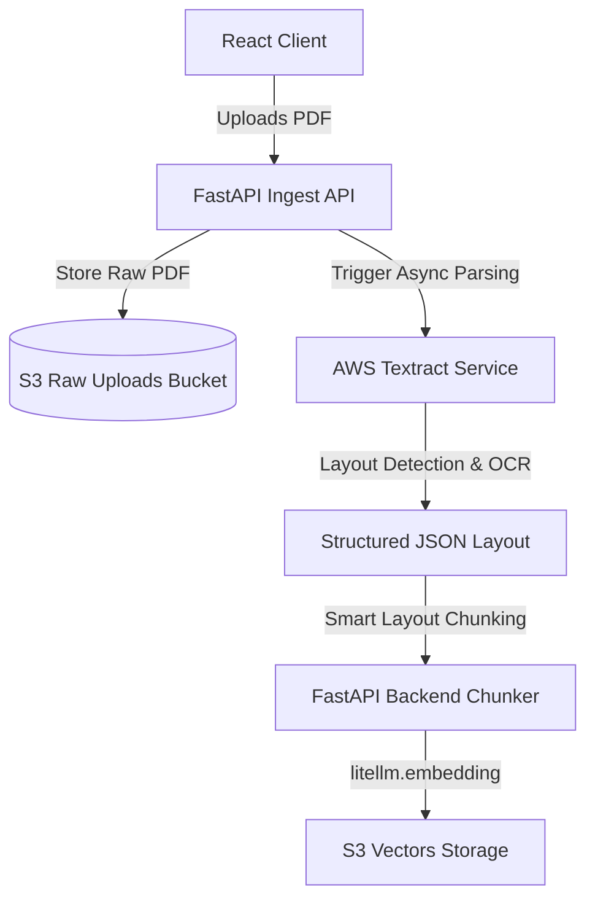

# AWS S3 Vectors & LiteLLM Gemini RAG Integration Guide

This guide details the technical plan, architecture, and step-by-step codebase modifications required to integrate a native **Retrieval-Augmented Generation (RAG)** pipeline into the chatbot application.

This implementation leverages **Amazon S3 Vectors** (in preview) for serverless, cost-effective, high-scale vector storage and similarity search, combined with **LiteLLM** using the **Google Gemini-Embedding-2** model for high-fidelity text embedding generation.

---

## 1. Architectural Overview & Workflow

The proposed RAG integration connects simple text ingestion, high-fidelity embeddings, serverless vector search, and context-augmented chat generation into a unified, high-performance flow.

### RAG System Architecture Diagram

```mermaid
sequenceDiagram
    autonumber
    actor Client as React Client
    participant API as FastAPI Backend (Lambda)
    participant LiteLLM as LiteLLM (Gemini API)
    participant S3V as Amazon S3 Vectors
    participant Dynamo as DynamoDB Table

    %% Ingestion Flow
    rect rgb(25, 30, 42)
        Note over Client, S3V: Document Ingestion Flow
        Client->>API: POST /rag/ingest (Raw Text + Metadata)
        API->>API: Text Chunking (Recursive Splitter)
        API->>LiteLLM: litellm.embedding(model="gemini/gemini-embedding-2", chunks)
        LiteLLM-->>API: High-Dimensional Embeddings (768-dim)
        API->>S3V: s3vectors.put_vectors(VectorBucket, Index, Float32 Vectors)
        S3V-->>API: Ingestion Acknowledged (Index Updated)
        API-->>Client: 200 OK (Ingested Chunk Count, Document ID)
    end

    %% Query / Chat Flow
    rect rgb(30, 25, 42)
        Note over Client, Dynamo: Context-Augmented Query Flow (RAG Chat)
        Client->>API: POST /chat or /chat/stream (Message, use_rag=True, rag_documents=["doc1.txt"])
        API->>API: Save User Message in DynamoDB
        alt RAG Enabled (use_rag == True)
            API->>LiteLLM: litellm.embedding(model="gemini/gemini-embedding-2", message)
            LiteLLM-->>API: Query Vector (768-dim)
            API->>S3V: s3vectors.query_vectors(QueryVector, TopK=3, filter=rag_documents)
            S3V-->>API: Return Top-K Closest Chunks (Distance + Metadata Chunk Text)
            API->>API: Build System/Context Prompt (Grounded Context)
        else RAG Disabled (use_rag == False)
            API->>API: Build Standard System Prompt
        end
        API->>API: Build LLM Prompt (History + Context + User Message)
        API->>LiteLLM: litellm.acompletion(Prompt)
        LiteLLM-->>API: Token Stream / Generation
        API->>Client: Stream response tokens to UI
        API->>API: Save Assistant Response & Update DynamoDB Context Cache
    end
```



### 1.1 Ingestion Pipeline Mechanics

For the initial version, the system processes clean, simple text inputs:

1. **Source Upload:** The user submits raw text data or files via the client dashboard.
2. **Text Chunking:** The backend partitions incoming text using a deterministic chunking policy (e.g., recursive character text splitting with a chunk size of 800 characters and a 10% overlap).
3. **Embedding Generation:** The backend invokes the LiteLLM API wrapper, sending text chunks in batches to get their corresponding 768-dimension vectors from the `gemini/gemini-embedding-2` model.
4. **Vector Storage:** The backend connects to the S3 Vectors client and issues a `put_vectors` batch call, uploading vectors mapped to chunk texts and source identifiers inside metadata fields.

### 1.2 Query & Context Retrieval Mechanics

When a user submits a chat prompt:

1. **Query Embedding:** The incoming chat string is embedded via LiteLLM to yield the query vector.
2. **Similarity Search:** The query vector is passed to the S3 Vectors client via `query_vectors` targeting the defined vector index.
3. **Context Augmentation:** The top $K$ relevant text chunks are extracted from the S3 Vectors response and assembled into a formatted markdown `[Context Block]`.
4. **Grounded Completion:** The `[Context Block]` is injected into the LLM system prompt instructing the assistant to rely exclusively on the retrieved facts to generate the final response.

---

## 2. Amazon S3 Vectors: Direct Integration Guide

**Amazon S3 Vectors** provides a fully serverless, highly durable, and cost-effective native vector indexing service inside Amazon S3.

### 2.1 Boto3 S3 Vectors Client Lifecycle

To interact with S3 Vectors, you initialize a specialized client in `boto3`:

```python
import boto3

# Initialize the dedicated s3vectors client
s3vectors_client = boto3.client("s3vectors", region_name="us-east-1")
```

### 2.2 S3 Vectors Control Plane Operations

#### A. Creating a Vector Bucket

Before storing vector indexes, you must establish an S3 Vector Bucket. Vector buckets are distinct from standard S3 buckets and are purpose-built for vector indexes:

```python
response = s3vectors_client.create_vector_bucket(
    VectorBucketName="chatbot-vectors-prod"
)
```

#### B. Creating a Vector Index

Inside a Vector Bucket, you provision individual Vector Indexes. You must explicitly configure the vector dimensions, precision, and similarity metric.

- For `gemini/gemini-embedding-2`, the standard output size is **768 dimensions**.
- The best similarity metric for text semantic search is **Cosine Similarity** (`cosine`).

```python
response = s3vectors_client.create_index(
    vectorBucketName="chatbot-vectors-prod",
    indexName="enterprise-kb",
    dataType="float32",          # S3 Vectors standard format
    dimension=768,              # Matching Gemini-Embedding-2 dimensions
    distanceMetric="cosine"      # Options: 'cosine', 'euclidean'
)
```

### 2.3 S3 Vectors Data Plane Operations

#### A. Ingesting Vectors (`put_vectors`)

Vectors must be supplied as an array of `float32` arrays. Up to 500 items can be written in a single batch.

```python
# Prepare vector data payloads
vectors_data = [
    {
        "key": "doc1_chunk0",
        "data": {
            "float32": [0.0125, -0.0543, ..., 0.1892]  # len = 768
        },
        "metadata": {
            "text": "FastAPI is a modern, fast (high-performance), web framework for building APIs with Python.",
            "source_doc": "fastapi_guide.txt",
            "chunk_idx": 0,
            "created_at": "2026-05-25T10:25:00Z"
        }
    }
]

# Write vectors into S3 Vectors index
response = s3vectors_client.put_vectors(
    vectorBucketName="chatbot-vectors-prod",
    indexName="enterprise-kb",
    vectors=vectors_data
)
```

#### B. Querying Similarity (`query_vectors`)

You perform similarity searches by sending a query vector and requesting the top-K closest neighbors. Optional key-value metadata filters can filter matching candidates.

```python
response = s3vectors_client.query_vectors(
    vectorBucketName="chatbot-vectors-prod",
    indexName="enterprise-kb",
    queryVector={
        "float32": [0.0098, -0.0412, ..., 0.1543]  # Query embedding vector
    },
    topK=3,
    returnDistance=True,
    returnMetadata=True
)

# Parsing retrieved context chunks
retrieved_chunks = []
for item in response.get("vectors", []):
    distance = item.get("distance")
    metadata = item.get("metadata", {})
    chunk_text = metadata.get("text", "")
    retrieved_chunks.append({
        "text": chunk_text,
        "source": metadata.get("source_doc"),
        "score": 1 - distance if distance else 0.0  # Convert distance to score
    })
```

---

## 3. LiteLLM Embedding Integration (Gemini Embeddings)

LiteLLM supports native batch embedding generation using the highly optimized Google `gemini-embedding-2` model via either direct Gemini API or Google Vertex AI.

### 3.1 Setup

Using the Gemini API directly requires setting the `GEMINI_API_KEY` environment variable. The value is already securely present in the `.env` configuration file:

```bash
GEMINI_API_KEY=AIzaSyD2a4p...
```

### 3.2 Basic Usage in Python

Generating embeddings for multiple document chunks is done using the standard asynchronous or synchronous LiteLLM `embedding` method:

```python
from litellm import embedding
import os

# Set Gemini API Key (typically auto-read from environment)
os.environ["GEMINI_API_KEY"] = "AIzaSyD2a4p..."

# Invoke Gemini Embedding API
response = embedding(
    model="gemini/gemini-embedding-2",
    input=[
        "First text chunk to represent as a mathematical vector.",
        "Second semantic fragment to encode in the same latent space."
    ]
)

# Extract embedding float lists
embeddings = [item["embedding"] for item in response["data"]]
# Each embedding is an array of exactly 768 float values
```

---

## 4. Backend Architecture & Codebase Changes

To implement this RAG architecture, code changes will span the config layer, new services, custom APIs, and the core chat integration.

```
backend/
├── app/
│   ├── settings.py                <-- [MODIFY] Add RAG & S3 Vector config settings
│   ├── models/
│   │   └── schemas.py             <-- [MODIFY] Add use_rag & rag_documents to ChatRequest
│   ├── dependencies.py            <-- [MODIFY] Add dependency injector for Vector Store
│   ├── services/
│   │   ├── vector_store.py        <-- [NEW] Encapsulates LiteLLM & S3 Vectors APIs
│   │   └── rag.py                 <-- [NEW] Orchestrates Chunking, Ingestion, & Retrieval
│   └── api/
│       └── routes.py              <-- [MODIFY] Integrate Context Search in /chat and /chat/stream, add /rag endpoints
└── template.yaml                  <-- [MODIFY] Add IAM Policies for S3 Vectors
```

### 4.1 Modifying `backend/app/settings.py`

Add settings variables to manage the RAG pipeline configurations:

```python
# backend/app/settings.py modifications:

class Settings(BaseSettings):
    # ... existing parameters ...

    # S3 Vectors Configurations
    s3_vector_bucket_name: str = Field(
        default="chatbot-vectors-prod", validation_alias="S3_VECTOR_BUCKET_NAME"
    )
    s3_vector_index_name: str = Field(
        default="enterprise-kb", validation_alias="S3_VECTOR_INDEX_NAME"
    )

    # Embedding Configurations
    litellm_embedding_model: str = Field(
        default="gemini/gemini-embedding-2", validation_alias="LITELLM_EMBEDDING_MODEL"
    )
    embedding_dimension: int = Field(
        default=768, validation_alias="EMBEDDING_DIMENSION"
    )
```

### 4.2 Modifying `backend/app/models/schemas.py`

Add optional RAG parameters (`use_rag` and `rag_documents`) inside the Pydantic schema for `ChatRequest`:

```python
# backend/app/models/schemas.py modifications:

class ChatRequest(BaseModel):
    message: str = Field(min_length=1)
    conversation_id: str | None = None
    user_id: str | None = None

    # New parameters to govern dynamic RAG routing
    use_rag: bool = Field(default=False)
    rag_documents: list[str] | None = Field(default=None)
```

### 4.3 Modifying `backend/app/dependencies.py`

Establish the dependency injection logic for the Vector Store and RAG services. This logic securely retrieves the Gemini API Key from the AWS SSM Parameter Store using the existing `litellm_vision_api_key` parameter (passed via the `LITELLM_VISION_API_KEY_PARAMETER` environment variable):

```python
# backend/app/dependencies.py modifications:

from .services.vector_store import VectorStoreClient
from .services.rag import RagService

@lru_cache
def get_vector_store() -> VectorStoreClient:
    settings = get_settings()

    # Retrieve Gemini API Key from the existing SSM parameter
    api_key = settings.litellm_vision_api_key
    ssm_param_name = os.getenv("LITELLM_VISION_API_KEY_PARAMETER")  # points to /chatbot/litellm_vision_api_key
    if ssm_param_name:
        ssm_key = get_ssm_parameter(ssm_param_name)
        if ssm_key:
            api_key = ssm_key

    # Fallback to direct environment variable for local dev
    if not api_key:
        api_key = os.getenv("GEMINI_API_KEY")

    return VectorStoreClient(
        region_name=settings.aws_region,
        vector_bucket=settings.s3_vector_bucket_name,
        index_name=settings.s3_vector_index_name,
        embedding_model=settings.litellm_embedding_model,
        dimension=settings.embedding_dimension,
        gemini_api_key=api_key
    )

def get_rag_service(vector_store=Depends(get_vector_store)) -> RagService:
    return RagService(vector_store)
```

### 4.4 Adding `backend/app/services/vector_store.py`

Create a clean client class that wraps `boto3` `s3vectors` client calls and handles LiteLLM embeddings:

```python
# backend/app/services/vector_store.py
from __future__ import annotations
import logging
import boto3
from litellm import embedding

logger = logging.getLogger(__name__)

class VectorStoreClient:
    def __init__(
        self,
        region_name: str,
        vector_bucket: str,
        index_name: str,
        embedding_model: str,
        dimension: int,
        gemini_api_key: str | None = None
    ):
        self.vector_bucket = vector_bucket
        self.index_name = index_name
        self.embedding_model = embedding_model
        self.dimension = dimension
        self.gemini_api_key = gemini_api_key

        # Initialize boto3 S3 Vectors client
        self.client = boto3.client("s3vectors", region_name=region_name)
        logger.info(
            "VectorStoreClient initialized: bucket=%s index=%s model=%s",
            vector_bucket, index_name, embedding_model
        )

    def initialize_storage(self) -> None:
        """Ensures that the target Vector Bucket and Index exist in AWS."""
        try:
            logger.info("Initializing S3 Vector Bucket %s", self.vector_bucket)
            try:
                self.client.create_vector_bucket(VectorBucketName=self.vector_bucket)
            except self.client.exceptions.VectorBucketAlreadyExistsException:
                logger.info("S3 Vector Bucket %s already exists.", self.vector_bucket)

            logger.info("Initializing S3 Vector Index %s", self.index_name)
            try:
                self.client.create_index(
                    vectorBucketName=self.vector_bucket,
                    indexName=self.index_name,
                    dataType="float32",
                    dimension=self.dimension,
                    distanceMetric="cosine"
                )
            except self.client.exceptions.IndexAlreadyExistsException:
                logger.info("S3 Vector Index %s already exists.", self.index_name)
        except Exception:
            logger.exception("Failed to initialize S3 Vector Storage")
            raise

    async def get_embeddings(self, texts: list[str]) -> list[list[float]]:
        """Invokes LiteLLM to generate vectors from text array."""
        try:
            response = embedding(
                model=self.embedding_model,
                input=texts,
                api_key=self.gemini_api_key
            )
            return [item["embedding"] for item in response["data"]]
        except Exception:
            logger.exception("Failed to generate LiteLLM embeddings")
            raise

    async def upsert_chunks(self, keys: list[str], texts: list[str], embeddings: list[list[float]], source_doc: str) -> None:
        """Uploads multiple embedded vectors and text metadata into S3 Vectors."""
        try:
            vectors_payload = []
            for i, (key, text, vector) in enumerate(zip(keys, texts, embeddings)):
                vectors_payload.append({
                    "key": key,
                    "data": {"float32": vector},
                    "metadata": {
                        "text": text,
                        "source_doc": source_doc,
                        "chunk_idx": i
                    }
                })

            # s3vectors.put_vectors supports up to 500 items per request
            batch_size = 400
            for offset in range(0, len(vectors_payload), batch_size):
                batch = vectors_payload[offset:offset + batch_size]
                self.client.put_vectors(
                    vectorBucketName=self.vector_bucket,
                    indexName=self.index_name,
                    vectors=batch
                )
            logger.info("Successfully ingested %d chunks into index %s", len(keys), self.index_name)
        except Exception:
            logger.exception("Failed to put vectors in S3 Vectors")
            raise

    async def similarity_search(self, query_text: str, top_k: int = 3, documents: list[str] | None = None) -> list[dict]:
        """Queries S3 Vectors similarity based on a user text query, filtering by selected documents if specified."""
        try:
            query_embeddings = await self.get_embeddings([query_text])
            query_vector = query_embeddings[0]

            # Construct S3 Vectors metadata filter
            query_filter = None
            if documents:
                if len(documents) == 1:
                    query_filter = {"source_doc": documents[0]}
                else:
                    query_filter = {"source_doc": {"$in": documents}}

            query_args = {
                "vectorBucketName": self.vector_bucket,
                "indexName": self.index_name,
                "queryVector": {"float32": query_vector},
                "topK": top_k,
                "returnDistance": True,
                "returnMetadata": True
            }
            if query_filter:
                query_args["filter"] = query_filter

            response = self.client.query_vectors(**query_args)

            results = []
            for item in response.get("vectors", []):
                distance = item.get("distance", 1.0)
                metadata = item.get("metadata", {})
                results.append({
                    "text": metadata.get("text", ""),
                    "source": metadata.get("source_doc", "unknown"),
                    "score": round(1.0 - distance, 4)
                })
            return results
        except Exception:
            logger.exception("Similarity search failed")
            return []
```

### 4.5 Adding `backend/app/services/rag.py`

Create a service class to handle text chunking and orchestration:

```python
# backend/app/services/rag.py
from __future__ import annotations
import uuid
from .vector_store import VectorStoreClient

class RagService:
    def __init__(self, vector_store: VectorStoreClient):
        self.vector_store = vector_store

    def _split_text(self, text: str, chunk_size: int = 800, overlap: int = 80) -> list[str]:
        """Splits simple text into overlapping fragments."""
        chunks = []
        start = 0
        while start < len(text):
            end = start + chunk_size
            chunks.append(text[start:end])
            start += chunk_size - overlap
        return chunks

    async def ingest_document(self, filename: str, content: str) -> int:
        """Splits, embeds, and indexes a text document."""
        chunks = self._split_text(content)
        if not chunks:
            return 0

        # Generate embeddings
        embeddings = await self.vector_store.get_embeddings(chunks)

        # Build keys
        doc_id = str(uuid.uuid4())[:8]
        keys = [f"doc_{doc_id}_chunk_{i}" for i in range(len(chunks))]

        # Store in S3 Vectors
        await self.vector_store.upsert_chunks(
            keys=keys,
            texts=chunks,
            embeddings=embeddings,
            source_doc=filename
        )
        return len(chunks)
```

### 4.6 Modifying `backend/app/api/routes.py`

Augment standard chats with context retrieval:

#### Modifying the System Prompt

To ensure the LLM outputs replies grounded entirely in your retrieval vector documents, you update the LLM payload system context:

```python
# Context Retrieval Logic inside chat() and chat_stream():

# 1. Check if RAG retrieval is requested
context_results = []
if payload.use_rag:
    # Query similarity search, filtering by selected documents (if specified)
    context_results = await vector_store.similarity_search(
        payload.message,
        top_k=3,
        documents=payload.rag_documents
    )

# 2. Build Grounded Context Block
if context_results:
    context_str = "\n\n".join(
        f"[Source: {item['source']} | Score: {item['score']}]:\n{item['text']}"
        for item in context_results
    )
    grounded_system_prompt = (
        "You are an expert AI Assistant. Rely ONLY on the following retrieved context "
        "to answer the user's question. If the information is not contained in the context, "
        "politely state that you do not know. Do not hallucinate or use external facts.\n\n"
        f"### Retrieved Context:\n{context_str}"
    )
else:
    grounded_system_prompt = "You are a helpful AI assistant."

# 3. Assemble complete message array for LLM completion
messages = [{"role": "system", "content": grounded_system_prompt}]
messages.extend(build_history_messages(history))
messages.append({"role": "user", "content": payload.message})

# 4. Generate Completion using LiteLLM (gemini/gemini-3.1-flash-lite etc.)
assistant_text = await llm.generate(messages)
```

#### New RAG Endpoints

Introduce two endpoints for direct ingestion and testing of the S3 vector database:

```python
from fastapi import APIRouter, Depends, status, Body
from ..dependencies import get_rag_service, get_vector_store

@router.post("/rag/ingest", status_code=status.HTTP_201_CREATED)
async def ingest_rag_text(
    filename: str = Body(..., embed=True),
    content: str = Body(..., embed=True),
    rag_service=Depends(get_rag_service)
):
    """Chunks, embeds, and ingests a text block into the S3 vector index."""
    try:
        chunks_count = await rag_service.ingest_document(filename, content)
        return {
            "status": "success",
            "filename": filename,
            "chunks_ingested": chunks_count
        }
    except Exception as e:
        raise HTTPException(
            status_code=status.HTTP_500_INTERNAL_SERVER_ERROR,
            detail=f"Ingestion failed: {str(e)}"
        )

@router.post("/rag/search")
async def search_rag_context(
    query: str = Body(..., embed=True),
    top_k: int = Body(3, embed=True),
    vector_store=Depends(get_vector_store)
):
    """Directly queries the S3 Vector index for debugging and verification."""
    results = await vector_store.similarity_search(query, top_k=top_k)
    return {"query": query, "results": results}
```

---

## 5. Future Scalability: AWS Textract Integration

While simple text chunking serves as the baseline, the architecture is ready to scale to heavy multi-page digital PDFs using **AWS Textract**.

### 5.1 Why AWS Textract?

Simple PDF parsers (like PyMuPDF) extract plain raw text strings. However, they struggle with structural components like:

1. **Multi-Column Layouts:** Mixing independent text blocks together in horizontal lines.
2. **Tables and Forms:** Scrambling cell grids into unreadable strings, breaking mathematical or list relationships.
3. **Embedded Images/Diagrams:** Completely omitting visual concepts.

AWS Textract uses specialized deep-learning models to parse digital layout structures, preserving grid relationships and extracting form keys/values natively.

### 5.2 Scaled PDF Ingestion Pipeline

When scaling PDF files later, the ingestion pipeline will evolve into an asynchronous pattern:



1. **Async Lambda Invocation:** A PDF file is uploaded to the private S3 storage bucket. An asynchronous event notifies a document-processor worker.
2. **AWS Textract Layout API:** Invoke Textract's `StartDocumentAnalysis` with `FeatureTypes=['LAYOUT', 'TABLES']`.
3. **Structured Ingestion:** Once Textract finishes parsing, the backend fetches the analysis blocks (`GetDocumentAnalysis`).
4. **Layout-Aware Chunking:** Chunks are split dynamically by **sections** (e.g., matching actual PDF paragraphs, tables, or lists) instead of rigid character counts. Tables are formatted cleanly into markdown grids (`| Col 1 | Col 2 |`) before embedding to ensure maximum semantic retrieval clarity.

---

## 6. Infrastructure Infrastructure Configuration (`template.yaml`)

To permit your Lambda execution environment to manage the S3 Vector buckets and run queries, update the IAM policy declarations in the backend function's serverless resource.

### Modifying IAM execution role in `template.yaml`:

```yaml
# Add to ChatbotBackendFunction.Properties.Policies in template.yaml:

# S3 Vectors Operations permissions
- Statement:
    - Effect: Allow
      Action:
        - s3vectors:CreateVectorBucket
        - s3vectors:CreateIndex
        - s3vectors:PutVectors
        - s3vectors:QueryVectors
        - s3vectors:GetVectors
        - s3vectors:ListIndexes
        - s3vectors:ListVectorBuckets
      Resource: "*"
```

---

## 7. Verification Plan & Testing

To confirm the correctness of the LiteLLM Gemini embedding and S3 Vectors similarity matching:

### 7.1 Automated Backend Integration Tests

Add unit/integration tests under `backend/tests/test_rag.py` to assert correct dimensions and retrieval performance:

```python
# backend/tests/test_rag.py
import pytest
from app.services.vector_store import VectorStoreClient

@pytest.mark.asyncio
async def test_gemini_embedding_generation(settings):
    """Verifies that litellm produces correct embedding output dimensions."""
    client = VectorStoreClient(
        region_name=settings.aws_region,
        vector_bucket=settings.s3_vector_bucket_name,
        index_name=settings.s3_vector_index_name,
        embedding_model=settings.litellm_embedding_model,
        dimension=settings.embedding_dimension,
        gemini_api_key=settings.litellm_api_key
    )

    test_text = "Checking that Gemini-Embedding-2 returns the expected dimension size."
    vectors = await client.get_embeddings([test_text])

    assert len(vectors) == 1
    assert len(vectors[0]) == 768  # Gemini dimension

@pytest.mark.asyncio
async def test_s3_vectors_ingestion_and_query(settings):
    """Verifies that we can put and query vectors dynamically."""
    # Mocking or using local stack with s3vectors if available, or direct connection
    pass
```

### 7.2 Manual Verification Steps

1. **Initialize Indexes:** Invoke `VectorStoreClient.initialize_storage()` to automatically provision the Vector Bucket and the default Index in the AWS Account.
2. **Ingest Verification Payload:** Execute a curl command to insert specific facts:
   ```bash
   curl -X POST "http://localhost:8000/api/rag/ingest" \
        -H "Content-Type: application/json" \
        -H "Authorization: Bearer <JWT_TOKEN>" \
        -d '{"filename": "company_rules.txt", "content": "The secure Wi-Fi network password is AntigravityRAG2026."}'
   ```
3. **Query Similarity Verification:** Execute a retrieval query:
   ```bash
   curl -X POST "http://localhost:8000/api/rag/search" \
        -H "Content-Type: application/json" \
        -H "Authorization: Bearer <JWT_TOKEN>" \
        -d '{"query": "What is the Wi-Fi password?"}'
   ```
   Assert that the returned context chunks list `company_rules.txt` with a high similarity score.
4. **Chat Ingestion Verification:** Message the chatbot: _"What is the secure Wi-Fi password?"_ Assert that the chatbot replies: _"The secure Wi-Fi network password is AntigravityRAG2026."_ based entirely on the retrieved S3 Vectors document.
