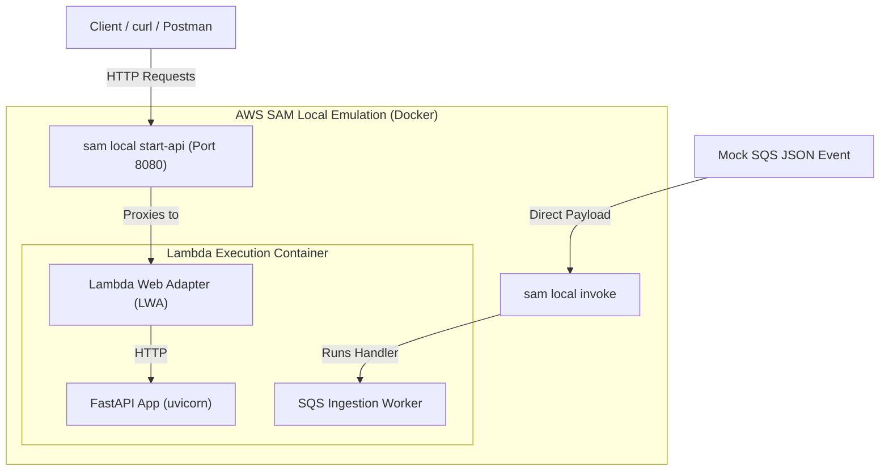

# AWS SAM Local Testing & Debugging Guide

This guide provides comprehensive instructions on how to run, test, and debug your serverless backend application locally using the **AWS SAM (Serverless Application Model) CLI** and **Docker**.

---

## 🛠️ Overview of SAM Local Capabilities

AWS SAM CLI offers several commands to emulate AWS serverless services locally:

1. **`sam local start-api`**: Spawns a local HTTP server hosting your FastAPI application via API Gateway HTTP API emulation.
2. **`sam local invoke`**: Executes a one-off invocation of a specific Lambda function (such as your SQS Ingestion Worker) with a mock event payload.
3. **`sam local start-lambda`**: Establishes a local endpoint mimicking the AWS Lambda Service, allowing programmatic invocation via `boto3` or other AWS SDKs.



---

## 📋 Prerequisites

Before proceeding, ensure you have the following installed on your host machine:

- **Docker Desktop**: Must be running (SAM runs functions within dedicated Docker container instances).
- **AWS SAM CLI**: [Install SAM CLI](https://docs.aws.amazon.com/serverless-application-model/latest/developerguide/install-sam-cli.html).
- **Python 3.12** & **`uv` package manager**.

---

## 🚀 Step-by-Step Instructions

### 1. Build the Application

Before running any local testing command, you must package the application using `sam build`.

Because the project utilizes `uv` for dependency resolution, we first export a flat `requirements.txt` file which the SAM builder parses:

```bash
# 1. Navigate to the backend directory and export requirements.txt
cd backend
uv export --format requirements-txt --no-hashes --no-emit-project -o requirements.txt
cd ..

# 2. Build the SAM template inside a container
sam build --use-container
```

> [!TIP]
> **Why `--use-container`?**
> This compiles any binary C-extensions inside a Docker container matching the AWS Lambda execution environment (Amazon Linux), avoiding runtime dynamic link errors.

---

### 2. Configure Local Environment Variables (`env.json`)

Since SAM runs functions inside isolated containers, they do not automatically inherit your shell's environment variables.

Create a file named `env.json` in the root of your project:

```json
{
  "ChatbotBackendFunction": {
    "Environment": "dev",
    "DYNAMODB_TABLE_NAME": "chatbot-table-dev",
    "S3_BUCKET_NAME": "chatbot-uploads-dev",
    "LITELLM_MODEL": "openai/gpt-4o-mini",
    "LITELLM_BASE_URL": "https://api.openai.com/v1",
    "LITELLM_API_KEY": "sk-proj-your-api-key-here",
    "LOG_LEVEL": "DEBUG"
  },
  "ChatbotIngestionWorkerFunction": {
    "Environment": "dev",
    "DYNAMODB_TABLE_NAME": "chatbot-table-dev",
    "S3_BUCKET_NAME": "chatbot-uploads-dev",
    "LITELLM_EMBEDDING_MODEL": "gemini/gemini-embedding-2",
    "LITELLM_API_KEY": "your-api-key-here",
    "LOG_LEVEL": "DEBUG"
  }
}
```

---

### 3. Emulating the HTTP API Gateway (`sam local start-api`)

This hosts your FastAPI application behind a local API Gateway server.

```bash
sam local start-api --env-vars env.json --port 8080
```

- **Interactive Docs**: Visit `http://localhost:8080/docs` in your browser.
- **Health Check**:
  ```bash
  curl http://localhost:8080/health
  # {"status":"ok"}
  ```
- **Send a Chat Message**:
  ```bash
  curl -X POST http://localhost:8080/chat \
    -H "Content-Type: application/json" \
    -d '{"message": "Hello, bot!", "user_id": "tester"}'
  ```

---

### 4. Testing the SQS Background Ingestion Worker (`sam local invoke`)

The `ChatbotIngestionWorkerFunction` consumes messages containing S3 Event Notifications. You can invoke it directly by passing a mock SQS event payload.

#### Step A: Generate a Mock Event Payload

Save the following SQS payload as `events/sqs-s3-event.json` (create the `events` directory if it does not exist):

```json
{
  "Records": [
    {
      "messageId": "19dd0b1e-9b69-4e1b-a0cc-de5d1947b415",
      "receiptHandle": "MessageReceiptHandle",
      "body": "{\n  \"Records\": [\n    {\n      \"eventVersion\": \"2.1\",\n      \"eventSource\": \"aws:s3\",\n      \"awsRegion\": \"ap-south-1\",\n      \"eventTime\": \"2026-05-26T10:00:00.000Z\",\n      \"eventName\": \"ObjectCreated:Put\",\n      \"s3\": {\n        \"s3SchemaVersion\": \"1.0\",\n        \"configurationId\": \"testConfigRule\",\n        \"bucket\": {\n          \"name\": \"chatbot-uploads-dev\",\n          \"arn\": \"arn:aws:s3:::chatbot-uploads-dev\"\n        },\n        \"object\": {\n          \"key\": \"staging/tester/doc123/sample_report.txt\",\n          \"size\": 1024,\n          \"eTag\": \"d41d8cd98f00b204e9800998ecf8427e\",\n          \"sequencer\": \"0055AED6DCD90281E5\"\n        }\n      }\n    }\n  ]\n}",
      "eventSource": "aws:sqs",
      "awsRegion": "ap-south-1"
    }
  ]
}
```

#### Step B: Invoke the Ingestion Worker Lambda

Execute the invocation:

```bash
sam local invoke ChatbotIngestionWorkerFunction \
  --event events/sqs-s3-event.json \
  --env-vars env.json
```

SAM will:

1. Spin up the Lambda container.
2. Direct the mock SQS message containing the S3 pointer to `app.worker.handler`.
3. Read the mock file from the specified S3 bucket.
4. Process embedding extraction, database status updates, and finally clean up the staging bucket file.

---

### 5. Running a Local Lambda Endpoint (`sam local start-lambda`)

If you wish to test programmatic invocations (e.g. executing lambda invokes from the AWS SDK/CLI):

```bash
sam local start-lambda --env-vars env.json --port 3001
```

You can then test via the AWS CLI:

```bash
aws lambda invoke \
  --function-name "ChatbotBackendFunction" \
  --endpoint-url "http://127.0.0.1:3001" \
  --no-verify-ssl \
  out.json
```

---

## 🛜 Connecting to Local Databases (DynamoDB / Minio)

If you are running DynamoDB Local or Minio on your host machine inside a Docker container network:

1. **Find the Docker network name** running your local infrastructure (e.g. `chatbot-network`):
   ```bash
   docker network ls
   ```
2. **Launch SAM Local** inside that same Docker network:
   ```bash
   sam local start-api --env-vars env.json --port 8080 --docker-network chatbot-network
   ```
3. **Update your `env.json` endpoints** to target the docker service names instead of `localhost`:
   ```json
   "DYNAMODB_ENDPOINT_URL": "http://dynamodb-local:8000",
   "S3_ENDPOINT_URL": "http://minio-s3:9000",
   "S3_FORCE_PATH_STYLE": "true"
   ```

---

## 💡 Troubleshooting & Performance Tips

- **Fast Rebuilds**: If you only make changes to your Python source code files (and have not introduced new dependencies in `pyproject.toml`), you can run `sam build` without the `--use-container` flag. It completes in a fraction of the time!
- **Warm Containers**: To keep the Docker container running between API requests (improving response time significantly during testing), use the `--warm-containers` flag:
  ```bash
  sam local start-api --env-vars env.json --port 8080 --warm-containers EAGER
  ```
- **Debug Port Integration**: You can attach VS Code or PyCharm remote debuggers by exposing port 5678 inside the SAM runtime:
  ```bash
  sam local start-api --env-vars env.json -d 5678
  ```
