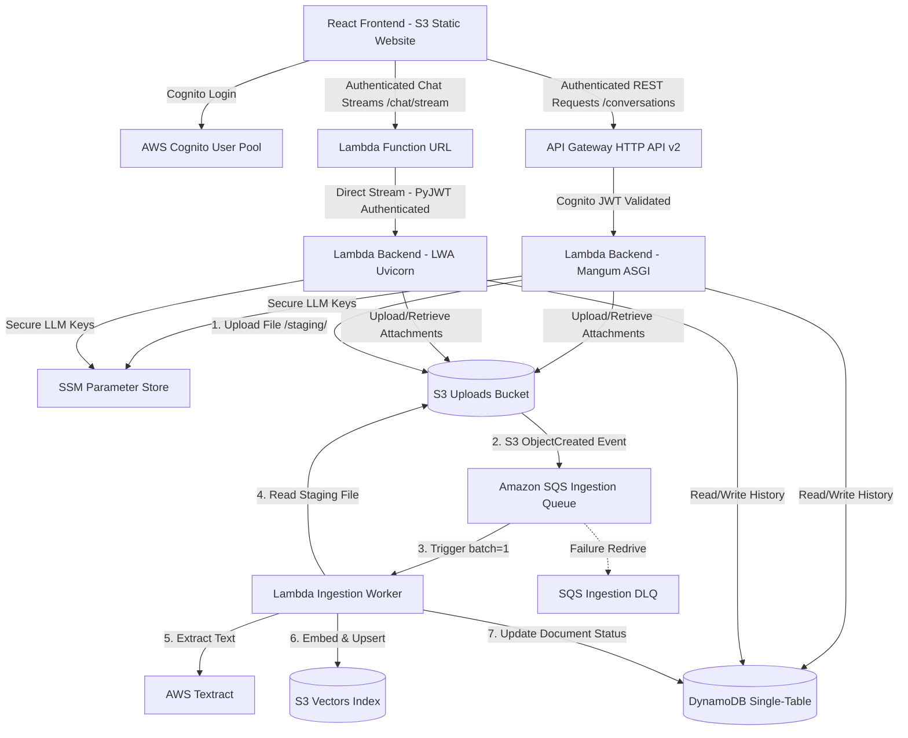

# AWS SAM Infrastructure Template Analysis

This document provides a line-by-line and section-by-section breakdown of the serverless infrastructure declared in the `template.yaml` file. It explains what each parameter, global variable, resource, and output accomplishes, why it was chosen, and alternative approaches where applicable.

---

## 1. Architectural Overview

The infrastructure declared in this SAM template represents a modern, serverless hybrid-routing architecture designed for optimal cost-efficiency, scalability, and responsiveness.

The architecture separates standard transactional operations (user session routing, history fetching, and profile settings) from heavy streaming operations (real-time chat generation) and asynchronous document ingestion workflows. It leverages:

1. **Amazon Cognito** for secure user authentication.
2. **Amazon API Gateway HTTP APIs (v2)** with a Cognito JWT Authorizer for securing metadata and CRUD endpoints.
3. **AWS Lambda Function URLs (FURL)** configured with **AWS Lambda Web Adapter (LWA)** and `RESPONSE_STREAM` invocation mode to deliver ultra-low Time-to-First-Byte (TTFB) token streaming from LiteLLM.
4. **Amazon DynamoDB** with a single-table composite key layout and a Global Secondary Index for highly efficient user conversation histories.
5. **Amazon S3** for secure, private uploads alongside a public static S3 bucket for frontend React hosting.
6. **Amazon SQS (Simple Queue Service)** with a Dead Letter Queue (DLQ) to decouple heavy RAG document ingestion flows, triggered via S3 Event Notifications under the `staging/` key prefix.
7. **AWS Lambda Ingestion Worker Function** running asynchronously to parse files using AWS Textract, calculate vector embeddings using LiteLLM/Gemini, index them in S3 Vectors, and update DynamoDB.



### 1.1 How Key Services Work Under the Hood

To understand the infrastructure declared in `template.yaml`, it is important to analyze the operational mechanics of the key services under the hood:

#### A. Amazon Cognito (Authentication Directory)

Cognito acts as an OIDC-compliant Identity Provider (IdP).

- **User Authentication:** The React frontend bypasses heavy SDK dependencies and communicates directly with Cognito’s public identity endpoints (`https://cognito-idp.<region>.amazonaws.com/`) using standard `fetch` with the `InitiateAuth` payload.
- **Token Verification:** On login, Cognito yields a cryptographically signed **ID Token (JWT)**. API Gateway (for REST) and FastAPI (for streaming) do not perform network round-trips to Cognito to validate this token. Instead, they perform **offline cryptographic validation**:
  1. They fetch Cognito’s JSON Web Key Set (JWKS) via `.well-known/jwks.json`.
  2. They match the token header’s Key ID (`kid`) with Cognito’s public keys.
  3. They decrypt the signature using RSA algorithms, validating that the token’s audience (`aud`) matches our User Pool Client ID, its issuer (`iss`) matches our User Pool URL, and it is not expired (`exp`).
  4. Once validated, the user's Cognito `sub` (Subject ID) is extracted and used as the unique `user_id` for database records.

#### B. AWS Lambda Web Adapter (LWA) & Function URLs (FURLs) for Response Streaming

- **Response Streaming Mode:** A Lambda Function URL provides a direct, highly performant HTTPS route to the Lambda handler. By enabling `RESPONSE_STREAM` invocation mode, AWS configures HTTP chunked transfer encoding, allowing Lambda to continuously flush data to the active TCP socket instead of buffering the response.
- **LWA Wrapper Interception:** The LWA layer operates as a bootstrap wrapper (`/opt/bootstrap`) inside Lambda's execution environment. At container start, LWA intercepts the execution, reads the `PORT: 8080` variable, and executes `run.sh` to boot Uvicorn.
- **ASGI to HTTP Translation:** When a stream request lands, LWA translates the AWS Lambda payload into standard ASGI requests and passes them to Uvicorn. When FastAPI's router yields a token chunk through a `StreamingResponse` (using `text/event-stream` media type), LWA immediately catches the chunk and writes it to the active HTTP socket, bringing Time-to-First-Byte (TTFB) down from 10 seconds to $\approx 250\text{ms}$.

#### C. Amazon DynamoDB (Single-Table Design, GSI, and TTL)

- **Single-Table Composite Key:** DynamoDB is a NoSQL database. Rather than building separate tables (e.g. `users`, `conversations`, `messages`), we co-locate all records in a single table (`chatbot-table-prod`) utilizing a composite primary key consisting of a partition key `pk` and sort key `sk`.
  - Conversation Metadata: `pk = CONV#<id>` and `sk = META`
  - Conversation Messages: `pk = CONV#<id>` and `sk = MSG#<timestamp>#<message_id>`
  - Conversation Cache Context: `pk = CONV#<id>` and `sk = CTX`
    This enables retrieving a conversation metadata and message logs in a single high-speed query operation instead of making multiple table joins.
- **Global Secondary Indexes (GSIs):** DynamoDB only permits high-speed queries on the partition key `pk`. Querying conversations by `user_id` would normally require a full **Table Scan**—a slow and expensive operation that parses every single record in the database. `UserConversationsIndex` mirrors the table, making `user_id` the alternate partition key and `sk` the sort key. Under the hood, AWS automatically replicates data from the main table partition to the GSI asynchronously, allowing instant, sorted conversation listing for a user.
- **TimeToLive (TTL):** To avoid storing stale data, DynamoDB's TTL scanner runs continuously in the background. When it identifies an item where the numeric `ttl` attribute (Unix timestamp) is lower than the current time, it marks the item as expired and purges it from the storage disks within 48 hours without consuming any provisioned WCU throughput.

#### D. S3 Static Hosting & Presigned URLs

- **Website Configuration:** S3 operates as an HTTP server when `WebsiteConfiguration` is enabled, hosting static client files. To support SPA client-side routers (like Vite's React Router), `index.html` is mapped to both the `IndexDocument` and the `ErrorDocument`. If a user navigates to `/conversations`, S3 serves the `index.html` wrapper, and client-side React routes intercept the path natively.
- **Presigned URLs for Security:** The upload bucket `ChatbotStorageBucket` is kept strictly private. To securely render uploaded images in the user’s browser, the backend uses `boto3` to generate an **S3 Presigned GET URL**. Under the hood, the backend cryptographically signs the file's S3 path using the Lambda's IAM execution role, appending query parameters (`X-Amz-Signature`, `X-Amz-Expires`). The browser uses this URL to download the image directly from S3 without making the bucket public.

#### E. Amazon SQS & Dead Letter Queues (Asynchronous Ingestion Decoupling)

- **S3 Event Notification trigger:** Document ingestion RAG flows represent heavy CPU operations. Instead of running them inside the standard synchronous user request cycle (which would time out at 30 seconds), the API function uploads files to S3 under the `/staging/` prefix and returns `202 Accepted` instantly.
- **Decoupled Job Buffering:** S3 uploads automatically trigger S3 Event Notifications which publish a job event directly to **Amazon SQS**.
  1. The queue (`IngestionQueue`) acts as a highly resilient buffer. It stores the message safely and handles automatic visibility management.
  2. If the worker encounters temporary errors (such as vector store locks or LLM timeout limits), SQS retries the message processing automatically.
  3. If a message fails standard processing 3 times (the `maxReceiveCount` policy limit), SQS automatically reroutes it to the Dead Letter Queue (`IngestionDLQ`) with a 14-day retention cycle. This guarantees that failed imports are captured and can be diagnosed without losing user uploads.

#### F. Asynchronous Worker Lambda (Dedicated Computation)

- **Dedicated Worker Resource:** Decorating the background process with a separate function (`ChatbotIngestionWorkerFunction`) provides isolated scale limits and resource allocation.
- **Visibility & Timeouts Alignment:** The worker function is configured with a **120-second timeout** to process large PDFs or documents via Textract. To ensure the queue doesn't release the message to a duplicate worker during this heavy processing window, the SQS Queue is configured with a **180-second Visibility Timeout**. This 1.5x timeout buffer prevents duplicate ingestion runs and race conditions.
- **SQS Trigger Integration:** The worker binds to SQS with a `BatchSize: 1` trigger configuration, executing one ingestion job at a time to prevent CPU resource thrashing and keep execution within safe boundaries.

---

## 2. Global Headers & Version Declarations

```yaml
AWSTemplateFormatVersion: "2010-09-09"
Transform: AWS::Serverless-2016-10-31
Description: Serverless Chatbot API deployed on AWS Lambda, DynamoDB, S3, and SSM.
```

### Explanation:

- **`AWSTemplateFormatVersion: '2010-09-09'`**: Identifies the version of the CloudFormation template structure. This is the latest standard template version.
- **`Transform: AWS::Serverless-2016-10-31`**: This line is critical; it tells CloudFormation that this is an **AWS Serverless Application Model (SAM)** template. This transform expands simplified serverless resource declarations (like `AWS::Serverless::Function` and `AWS::Serverless::HttpApi`) into fully fleshed-out low-level CloudFormation resources (like `AWS::Lambda::Function`, `AWS::ApiGatewayV2::Api`, and standard IAM execution roles) during the build phase.
- **`Description`**: A text description of the stack, visible in the CloudFormation Console.

### Alternatives:

- **Alternative:** Direct CloudFormation templates.
  - _Why SAM is better:_ Standard CloudFormation would require declaring verbose IAM execution policies, explicit Lambda trust relationships, API Gateway route mappings, and HTTP integration contracts manually, increasing the template size by 300%.

---

## 3. Template Parameters

Parameters enable customization of deployments across environments (like local, staging, and production) without hardcoding values in the template itself.

```yaml
Parameters:
  Environment:
    Type: String
    Default: prod
    Description: Deployment environment (dev, staging, prod)
```

- **Explanation:** Dictates the environment suffix for naming resources (e.g. `chatbot-table-prod`).
- **Why it was needed:** Isolates database tables, S3 buckets, and Cognito User Pools so staging environments or parallel developers do not corrupt production data.
- **Alternatives:** Hardcoding names. _Alternative is a major anti-pattern as it makes multi-environment setups impossible._

```yaml
LiteLlmModel:
  Type: String
  Default: openai/gpt-oss-120b
  Description: Model to use for chat generation via LiteLLM
```

- **Explanation:** Specifies the default LLM model passed to the LiteLLM backend wrapper for text chat completions.
- **Why it was needed:** Separates code changes from configuration changes. You can switch models (e.g., from `openai/gpt-4o` to `anthropic/claude-3-opus`) by deploying with a different parameter rather than rewriting backend code.
- **Alternatives:** Hardcoding the model string in `backend/app/services/llm.py`.

```yaml
LiteLlmVisionModel:
  Type: String
  Default: gemini/gemini-3.1-flash-lite
  Description: Vision model to use for chat generation via LiteLLM
```

- **Explanation:** Specifies the vision model mapped to `/chat/image` requests.
- **Why it was needed:** Vision prompts represent a separate class of LLM requests requiring specific pricing profiles. Hardcoding makes model swaps slow.
- **Alternatives:** Reusing `LiteLlmModel` for both text and image queries. _Rejected because many text-optimized models do not support multimodal image inputs._

```yaml
ContextTtlSeconds:
  Type: Number
  Default: 3600
  Description: Conversation context TTL in seconds
```

- **Explanation:** Set to `3600` (1 hour). Governs how long conversation cache summaries remain active in DynamoDB before disappearing.
- **Why it was needed:** Avoids loading massive historical contexts for stale chat sessions, which would consume API tokens and degrade LLM performance.
- **Alternatives:** Infinite session tracking in database memory, or client-side context tracking.

```yaml
LiteLlmBaseUrl:
  Type: String
  Default: https://integrate.api.nvidia.com/v1
  Description: Base URL for LiteLLM API
```

- **Explanation:** Configures the endpoint URL for LiteLLM requests. By default, it points to NVIDIA NIM API.
- **Why it was needed:** LiteLLM is a universal translation client. Supplying this URL allows routing requests to NVIDIA NIMs, local Llama.cpp instances, or Hugging Face endpoints.
- **Alternatives:** Standard OpenAI endpoints.

```yaml
LogLevel:
  Type: String
  Default: INFO
  AllowedValues: [DEBUG, INFO, WARNING, ERROR]
  Description: Python logging level for the Lambda function
```

- **Explanation:** Restricts logging strings to standard levels.
- **Why it was needed:** Allows toggling verbose `DEBUG` logs in staging for troubleshooting while keeping production on `INFO` to save log storage costs.
- **Alternatives:** Hardcoded logger config in Python code.

---

## 4. Globals Block

The `Globals` section specifies default properties that are applied automatically to all resources of a specific type.

```yaml
Globals:
  Function:
    Timeout: 30
    MemorySize: 512
    Runtime: python3.12
    Architectures:
      - arm64
```

### Explanation:

- **`Timeout: 30`**: Limits execution of all functions to 30 seconds.
  - _Why:_ Large LLM responses or image uploads can easily exceed API Gateway's default 29-second or Lambda's 3-second timeout limit. 30 seconds provides a comfortable margin for LLM chunk streaming and cold starts.
- **`MemorySize: 512`**: Allocates 512 MB of RAM.
  - _Why:_ In AWS Lambda, CPU power scales proportionally with allocated memory. 512MB provides optimal performance for Python's interpreter and dependency processing during cold starts.
- **`Runtime: python3.12`**: Uses the latest stable Python runtime supported by AWS Lambda.
- **`Architectures: [arm64]`**: Runs functions on AWS Graviton processors.
  - _Why:_ AWS Graviton architecture offers **20% lower cost** and up to **19% better performance** compared to standard x86 processors, and it matches Apple Silicon development host machines, avoiding cross-compilation errors.

---

## 5. Globals Environment Variables

Defines standard environment variables injected into all Lambda functions.

```yaml
Environment:
  Variables:
    DYNAMODB_TABLE_NAME: !Ref ChatbotTable
    S3_BUCKET_NAME: !Ref ChatbotStorageBucket
    LITELLM_MODEL: !Ref LiteLlmModel
    LITELLM_BASE_URL: !Ref LiteLlmBaseUrl
    LITELLM_VISION_MODEL: !Ref LiteLlmVisionModel
    LITELLM_VISION_API_KEY_PARAMETER: /chatbot/litellm_vision_api_key
    CONTEXT_TTL_SECONDS: !Ref ContextTtlSeconds
    MAX_HISTORY_MESSAGES: 10
    LITELLM_API_KEY_PARAMETER: /chatbot/litellm_api_key
    LOG_LEVEL: !Ref LogLevel
    COGNITO_USER_POOL_ID: !Ref ChatbotUserPool
    COGNITO_CLIENT_ID: !Ref ChatbotUserPoolClient
```

### Explanation:

- **`!Ref` mappings**: Dynamically resolves physical names of resources generated at deploy-time (e.g. mapping `!Ref ChatbotTable` to `chatbot-table-prod`).
- **`LITELLM_API_KEY_PARAMETER` & `LITELLM_VISION_API_KEY_PARAMETER`**: Instead of passing secret API keys in plain text (which is a critical security vulnerability), these point to path references in **AWS Systems Manager (SSM) Parameter Store** (`/chatbot/litellm_api_key`). The backend fetches and decrypts keys at runtime via boto3.
- **Alternatives:** Passing raw keys via `template.yaml`.
  - _Warning:_ Avoid this alternative; environment variables are visible in plaintext in the AWS Console, SAM CLI logs, and AWS CloudTrail logs.

---

## 6. Resources — ChatbotBackendFunction

```yaml
ChatbotBackendFunction:
  Type: AWS::Serverless::Function
  Properties:
    CodeUri: ./backend
    Handler: run.sh
```

- **Explanation:** Defines the core serverless function. `CodeUri` points SAM to build packages inside the local `./backend` directory.
- **`Handler: run.sh`**: Bypasses standard python entry points. This execution script launches the AWS Lambda Web Adapter wrapper.
- **Alternatives:** `app.main.handler` (standard Mangum handler). _Mangum was bypassed for streaming because it buffers payloads, destroying Time-to-First-Byte._

```yaml
Layers:
  - !Sub arn:aws:lambda:${AWS::Region}:753240598075:layer:LambdaAdapterLayerArm64:27
```

- **Explanation:** Bundles the **AWS Lambda Web Adapter (LWA)** layer. LWA translates Lambda events into standard HTTP requests, running a native `uvicorn` web server directly inside the execution context.
- **Why it was needed:** To enable true chunk-by-chunk HTTP token streaming, standard API Gateway event bridges fail. LWA maps ASGI `StreamingResponse` objects cleanly to active HTTP sockets.

### IAM Execution Policies:

```yaml
Policies:
  - DynamoDBCrudPolicy:
      TableName: !Ref ChatbotTable
  - S3CrudPolicy:
      BucketName: !Ref ChatbotStorageBucket
  - SSMParameterReadPolicy:
      ParameterName: chatbot/litellm_api_key
  - SSMParameterReadPolicy:
      ParameterName: chatbot/litellm_vision_api_key
```

- **Explanation:** Grants the Lambda execution role precise CRUD access to the S3 bucket, DynamoDB table, and read access to the SSM keys.
- **Why it was needed:** Follows the **Principle of Least Privilege**. The Lambda has access only to its specific resources.
- **Alternatives:** Custom inline IAM Roles with `Resource: "*"` wildcard actions (unsecured).

### Lambda Web Adapter Specific Config:

```yaml
Environment:
  Variables:
    AWS_LAMBDA_EXEC_WRAPPER: /opt/bootstrap
    AWS_LWA_INVOKE_MODE: response_stream
    PORT: "8080"
```

- **`AWS_LAMBDA_EXEC_WRAPPER`**: Pointed to `/opt/bootstrap`, forcing LWA to intercept function bootstrap.
- **`AWS_LWA_INVOKE_MODE: response_stream`**: Crucial variable that configures LWA to run in **Response Streaming Mode**, enabling immediate HTTP chunked transfer encoding responses.
- **`PORT: "8080"`**: Standardizes the internal forwarding socket.

### Function URL Configuration:

```yaml
FunctionUrlConfig:
  AuthType: NONE
  InvokeMode: RESPONSE_STREAM
```

- **Explanation:** Exposes a direct Lambda Function URL.
- **`AuthType: NONE`**: Shifts security token authorization into the application layer (FastAPI custom `PyJWT` middleware).
- **`InvokeMode: RESPONSE_STREAM`**: Bypasses API Gateway's 6MB payload and buffering limits, facilitating direct real-time streaming connections.
- **Alternatives:** standard API Gateway HTTP API proxying.
  - _Why API Gateway was rejected:_ API Gateway HTTP/REST endpoints strictly buffer all responses, forcing the frontend to wait 5-12 seconds for the full JSON instead of rendering immediate tokens.

### Event Mapping:

```yaml
Events:
  GetApiEvent:
    Type: HttpApi
    Properties:
      Path: /{proxy+}
      Method: GET
      ApiId: !Ref ChatbotHttpApi
  PostApiEvent:
    Type: HttpApi
    Properties:
      Path: /{proxy+}
      Method: POST
      ApiId: !Ref ChatbotHttpApi
  PutApiEvent:
    Type: HttpApi
    Properties:
      Path: /{proxy+}
      Method: PUT
      ApiId: !Ref ChatbotHttpApi
  DeleteApiEvent:
    Type: HttpApi
    Properties:
      Path: /{proxy+}
      Method: DELETE
      ApiId: !Ref ChatbotHttpApi
  HealthEvent:
    Type: HttpApi
    Properties:
      Path: /health
      Method: GET
      ApiId: !Ref ChatbotHttpApi
      Auth:
        Authorizer: NONE
```

- **Explanation:** Maps proxy routes (`GET`, `POST`, `PUT`, `DELETE` under `/{proxy+}`) to API Gateway.
- **Why it was split:** Explicitly sets up `GetApiEvent`, `PostApiEvent`, etc. Bypassing an explicit `OPTIONS` mapping allows API Gateway to consume and respond to browser CORS preflight requests natively without hitting the backend Lambda, reducing costs and preventing CORS errors.
- **`/health` Auth Bypass**: The `/health` route is marked with `Authorizer: NONE` to support public heartbeat monitoring from the React client.

---

## 7. CloudWatch Logging Infrastructure

```yaml
ChatbotBackendFunctionLogGroup:
  Type: AWS::Logs::LogGroup
  Properties:
    LogGroupName: !Sub /aws/lambda/${ChatbotBackendFunction}
    RetentionInDays: 7
```

### Explanation:

- **`RetentionInDays: 7`**: Explicitly expires Log streams after **7 days**.
- **Why it was needed:** By default, Lambda-created log groups are set to "Never Expire". If left unattended, high-volume chatbot logging will result in massive CloudWatch storage charges ($0.03 per GB/month). Declaring this resource inside SAM overrides default behavior, keeping log sizes bounded.
- **Alternatives:** Manual console logging cleanup.

---

## 8. API Gateway Configuration (`ChatbotHttpApi`)

```yaml
ChatbotHttpApi:
  Type: AWS::Serverless::HttpApi
  Properties:
    CorsConfiguration:
      AllowOrigins:
        - "*"
      AllowHeaders:
        - Content-Type
        - Authorization
      AllowMethods:
        - GET
        - POST
        - PUT
        - DELETE
        - OPTIONS
```

- **Explanation:** Declares the API Gateway HTTP API v2 resource.
- **`CorsConfiguration`**: Sets up global CORS policies for HTTP API gateways, authorizing standard REST methods and headers from different origins.

### Cognito API Gateway Authorizer:

```yaml
Auth:
  DefaultAuthorizer: CognitoAuthorizer
  Authorizers:
    CognitoAuthorizer:
      IdentitySource: "$request.header.Authorization"
      JwtConfiguration:
        Audience:
          - !Ref ChatbotUserPoolClient
        Issuer: !Sub "https://cognito-idp.${AWS::Region}.amazonaws.com/${ChatbotUserPool}"
```

- **Explanation:** Establishes edge-level request authorization.
- **`IdentitySource`**: Declares that API Gateway must parse incoming JWTs from the `Authorization` header.
- **`JwtConfiguration`**: Directly integrates with Cognito User Pools. API Gateway checks the JWT's signature against Cognito's cryptographic keys and validates token expiry. Unauthenticated requests are rejected immediately at the AWS edge before invoking or billing the Lambda.

---

## 9. DynamoDB Single Table Storage

```yaml
ChatbotTable:
  Type: AWS::DynamoDB::Table
  Properties:
    TableName: !Sub chatbot-table-${Environment}
    BillingMode: PROVISIONED
    ProvisionedThroughput:
      ReadCapacityUnits: 5
      WriteCapacityUnits: 5
```

- **Explanation:** Deploys a single-table DynamoDB instance.
- **`BillingMode: PROVISIONED`**: Explicitly selects Provisioned capacity, setting RCU and WCU values to 5.
- **Why it was chosen:** AWS offers 25 RCU and 25 WCU entirely **Always Free** for provisioned tables. Choosing "PAY_PER_REQUEST" (On-Demand) forfeits this free tier, incurring charges from request number one.
- **Alternatives:** On-Demand capacity (highly cost-inefficient for small workloads).

```yaml
AttributeDefinitions:
  - AttributeName: pk
    AttributeType: S
  - AttributeName: sk
    AttributeType: S
  - AttributeName: user_id
    AttributeType: S
KeySchema:
  - AttributeName: pk
    KeyType: HASH
  - AttributeName: sk
    KeyType: RANGE
```

- **Explanation:** Declares primary key schemas. Utilizes a composite primary key (`pk` HASH, `sk` RANGE) to enable Single-Table database design patterns (storing multiple entity types in one place).

### Global Secondary Index (GSI):

```yaml
GlobalSecondaryIndexes:
  - IndexName: UserConversationsIndex
    KeySchema:
      - AttributeName: user_id
        KeyType: HASH
      - AttributeName: sk
        KeyType: RANGE
    Projection:
      ProjectionType: ALL
    ProvisionedThroughput:
      ReadCapacityUnits: 5
      WriteCapacityUnits: 5
```

- **Explanation:** Defines a secondary querying index.
- **Why it was needed:** In standard composite key design, you cannot query items on attributes that are not part of the primary key without triggering a highly expensive Table Scan. Adding `UserConversationsIndex` allows the application to query and retrieve conversations belonging to a specific `user_id` sorted by timestamp `sk` with sub-millisecond latency.

### TTL Configuration:

```yaml
TimeToLiveSpecification:
  AttributeName: ttl
  Enabled: true
```

- **Explanation:** Instructs DynamoDB to automatically delete items when the timestamp stored in the `ttl` attribute is exceeded.
- **Why it was needed:** Deletes conversation caches after their Context TTL expires, saving storage fees.

---

## 10. Amazon S3 Storage Buckets

### Private Uploads & Ingestion Staging Bucket:

```yaml
ChatbotStorageBucket:
  Type: AWS::S3::Bucket
  DependsOn: IngestionQueuePolicy
  Properties:
    BucketName: !Sub chatbot-uploads-${AWS::AccountId}-${Environment}
    PublicAccessBlockConfiguration:
      BlockPublicAcls: true
      BlockPublicPolicy: true
      IgnorePublicAcls: true
      RestrictPublicBuckets: true
    LifecycleConfiguration:
      Rules:
        - Id: ExpireTemporaryUploads
          Status: Enabled
          ExpirationInDays: 7
    NotificationConfiguration:
      QueueConfigurations:
        - Event: s3:ObjectCreated:*
          Filter:
            S3Key:
              Rules:
                - Name: prefix
                  Value: staging/
          Queue: !GetAtt IngestionQueue.Arn
```

- **Explanation:** Private bucket for image and RAG document uploads. It incorporates the following key settings:
  - **`DependsOn: IngestionQueuePolicy`**: Enforces resource ordering. The bucket cannot be initialized before the SQS Queue Policy is active. This avoids S3 deployment failures when attaching event notifications to SQS queues.
  - **`PublicAccessBlockConfiguration`**: Strictly blocks public reads to protect private user documents.
  - **`LifecycleConfiguration`**: Automatically expires uploaded files after **7 days** to stay within AWS Free Tier storage boundaries.
  - **`NotificationConfiguration`**: Maps an S3 event notification system. Whenever a new file is uploaded under the `staging/` key prefix, S3 automatically publishes an `s3:ObjectCreated:*` message containing the bucket and object key to the SQS queue (`IngestionQueue`).
- **Why it was needed:** Serves as a staging ground for multi-page documents. The frontend uploads files directly here, which triggers the asynchronous background processing without keeping the client blocked in a busy-waiting loop.
- **Alternatives:** Public S3 bucket. _Warning: Public buckets leak user data._

---

### Static Frontend Web Hosting:

```yaml
ChatbotFrontendBucket:
  Type: AWS::S3::Bucket
  Properties:
    BucketName: !Sub chatbot-frontend-${AWS::AccountId}-${Environment}
    PublicAccessBlockConfiguration:
      BlockPublicAcls: false
      BlockPublicPolicy: false
      IgnorePublicAcls: false
      RestrictPublicBuckets: false
    WebsiteConfiguration:
      IndexDocument: index.html
      ErrorDocument: index.html
```

- **Explanation:** Public bucket configured as a static web server.
- **`WebsiteConfiguration`**: Maps standard SPA routing fallback (`index.html`) to handle Vite client-side React routes.

```yaml
ChatbotFrontendBucketPolicy:
  Type: AWS::S3::BucketPolicy
  Properties:
    Bucket: !Ref ChatbotFrontendBucket
    PolicyDocument:
      Version: "2012-10-17"
      Statement:
        - Sid: PublicReadGetObject
          Effect: Allow
          Principal: "*"
          Action: s3:GetObject
          Resource: !Sub arn:aws:s3:::${ChatbotFrontendBucket}/*
```

- **Explanation:** Explicit S3 policy granting public `GetObject` reads on all files inside the frontend bucket.
- **Alternatives:** CloudFront with Origin Access Control (OAC).
  - _Why direct S3 website was chosen:_ Simplifies staging deployment. Direct S3 static website endpoints avoid complex CloudFront edge caching, making updates instant without paying for CloudFront invalidation operations.

---

## 11. AWS SQS Queues for RAG Ingestion

Decoupling ingestion requires queues to buffer objects uploaded to S3 and process them asynchronously.

```yaml
# Dead Letter Queue for failed ingestion runs
IngestionDLQ:
  Type: AWS::SQS::Queue
  Properties:
    QueueName: !Sub chatbot-ingestion-dlq-${Environment}
    MessageRetentionPeriod: 1209600 # 14 days

# Main Ingestion Queue
IngestionQueue:
  Type: AWS::SQS::Queue
  Properties:
    QueueName: !Sub chatbot-ingestion-queue-${Environment}
    VisibilityTimeout: 180 # Must be >= Ingestion Worker Timeout (120s)
    RedrivePolicy:
      deadLetterTargetArn: !GetAtt IngestionDLQ.Arn
      maxReceiveCount: 3 # Retry failed messages 3 times before sending to DLQ
```

### Explanation:
- **`IngestionDLQ`**: Standard SQS queue set up as a Dead Letter Queue.
  - **`MessageRetentionPeriod: 1209600`** (14 days): Retains failed messages for two weeks (the maximum SQS allows), giving developers ample time to inspect, troubleshoot, and re-drive raw message payloads that failed processing.
- **`IngestionQueue`**: The primary job buffer.
  - **`VisibilityTimeout: 180`**: Crucial setting configured to **180 seconds**. When a worker Lambda polls a message, SQS hides the message from other workers. This timeout must exceed the processing Lambda's execution timeout (120s) with a margin of safety, ensuring a worker has enough time to complete the Textract parsing and RAG embedding before SQS assumes it failed and exposes the message to another worker.
  - **`RedrivePolicy`**: Re-routes messages to `IngestionDLQ` if they fail processing `3` times (`maxReceiveCount: 3`).

```yaml
IngestionQueuePolicy:
  Type: AWS::SQS::QueuePolicy
  Properties:
    Queues:
      - !Ref IngestionQueue
    PolicyDocument:
      Version: "2012-10-17"
      Statement:
        - Sid: AllowS3ToSendMessage
          Effect: Allow
          Principal:
            Service: s3.amazonaws.com
          Action: sqs:SendMessage
          Resource: !GetAtt IngestionQueue.Arn
          Condition:
            ArnLike:
              aws:SourceArn: !Sub "arn:aws:s3:::chatbot-uploads-${AWS::AccountId}-${Environment}"
            StringEquals:
              aws:SourceAccount: !Ref AWS::AccountId
```

### Explanation:
- **`IngestionQueuePolicy`**: Standard Queue Policy that authorizes S3's service principal (`s3.amazonaws.com`) to call `sqs:SendMessage` on our queue.
  - **`Condition`**: Strictly locks permissions using `SourceArn` matching our private uploads bucket name and `SourceAccount` matching the AWS Account ID. This prevents other S3 buckets in other AWS accounts from posting messages to our ingestion worker queue.

---

## 12. Ingestion Worker Lambda Function

This worker process consumes messages from the SQS queue and handles the end-to-end extraction, chunking, embedding, vector database indexing, and DynamoDB status updates completely out-of-band.

```yaml
ChatbotIngestionWorkerFunction:
  Type: AWS::Serverless::Function
  Properties:
    CodeUri: ./backend
    Handler: app.worker.handler
    Timeout: 120
    MemorySize: 512
    Policies:
      - SQSPollerPolicy:
          QueueName: !GetAtt IngestionQueue.QueueName
      - S3CrudPolicy:
          BucketName: !Sub chatbot-uploads-${AWS::AccountId}-${Environment}
      - DynamoDBCrudPolicy:
          TableName: !Ref ChatbotTable
      - SSMParameterReadPolicy:
          ParameterName: chatbot/litellm_api_key
      - SSMParameterReadPolicy:
          ParameterName: chatbot/litellm_vision_api_key
      - Statement:
          - Effect: Allow
            Action:
              - s3vectors:PutVectors
              - s3vectors:QueryVectors
              - s3vectors:GetVectors
              - s3vectors:ListIndexes
            Resource: !Sub "arn:aws:s3vectors:${AWS::Region}:${AWS::AccountId}:bucket/${S3VectorBucketName}/*"
          - Effect: Allow
            Action:
              - s3vectors:ListVectorBuckets
            Resource: "*"
          - Effect: Allow
            Action:
              - textract:DetectDocumentText
              - textract:StartDocumentTextDetection
              - textract:GetDocumentTextDetection
            Resource: "*"
    Events:
      SQSTrigger:
        Type: SQS
        Properties:
          Queue: !GetAtt IngestionQueue.Arn
          BatchSize: 1 # Process one file at a time
```

### Explanation:
- **`Handler: app.worker.handler`**: Sets the entry point to the background worker module, which processes SQS records instead of serving ASGI HTTP routes.
- **`Timeout: 120`**: Configures a generous 2-minute timeout to allow the execution context to download large files from S3, wait for Textract processing, split text chunks, generate embeddings, and upsert them.
- **`Policies`**: Follows least-privilege security by granting:
  - **`SQSPollerPolicy`**: Authorizes polling and deleting processed messages from `IngestionQueue`.
  - **`S3CrudPolicy`**: Grants permission to fetch staging files and delete them after successful ingestion.
  - **`DynamoDBCrudPolicy`**: Authorizes updating document registry status in the single DynamoDB table.
  - **`s3vectors` and `textract` policies**: Grants scoped permissions to interact with the serverless S3 Vector database indexes and AWS Textract OCR services.
- **`SQSTrigger`**: Maps the SQS event source.
  - **`BatchSize: 1`**: Instructs Lambda to invoke the function with exactly one message at a time. This isolates failures (a toxic file won't fail an entire batch of uploads) and bounds memory footprint.

```yaml
ChatbotIngestionWorkerFunctionLogGroup:
  Type: AWS::Logs::LogGroup
  Properties:
    LogGroupName: !Sub /aws/lambda/${ChatbotIngestionWorkerFunction}
    RetentionInDays: 7
```

### Explanation:
- **`ChatbotIngestionWorkerFunctionLogGroup`**: Explicitly caps worker logs retention to **7 days** to ensure diagnostic worker outputs do not quietly inflate CloudWatch storage costs.

---

## 13. AWS Cognito Authentication User Pools

```yaml
ChatbotUserPool:
  Type: AWS::Cognito::UserPool
  Properties:
    UserPoolName: !Sub chatbot-users-${Environment}
    UsernameAttributes:
      - email
    AutoVerifiedAttributes:
      - email
```

- **Explanation:** Provisions Cognito user directory.
- **`UsernameAttributes: [email]`**: Allows users to log in directly using email instead of complex username strings.
- **`AutoVerifiedAttributes: [email]`**: Auto-sends email validation messages upon signup.

```yaml
Policies:
  PasswordPolicy:
    MinimumLength: 8
    RequireLowercase: false
    RequireNumbers: false
    RequireSymbols: false
    RequireUppercase: false
Schema:
  - Name: email
    AttributeDataType: String
    Required: true
    Mutable: true
```

- **Explanation:** Governs sign-up configurations. Password policy restrictions are relaxed to simplify demo and testing access. Email is marked as a mandatory immutable attribute.

```yaml
ChatbotUserPoolClient:
  Type: AWS::Cognito::UserPoolClient
  Properties:
    ClientName: !Sub chatbot-client-${Environment}
    UserPoolId: !Ref ChatbotUserPool
    GenerateSecret: false
    ExplicitAuthFlows:
      - ALLOW_USER_PASSWORD_AUTH
      - ALLOW_REFRESH_TOKEN_AUTH
      - ALLOW_USER_SRP_AUTH
```

- **Explanation:** Registers the React frontend application with Cognito.
- **`GenerateSecret: false`**: Critical security property for Single Page Applications (SPAs). Client secrets cannot be stored securely inside browser JavaScript bundles; thus, secrets are disabled.
- **`ExplicitAuthFlows`**: Configures the direct authentication flows.

---

## 14. Template Outputs

Defines outputs generated after deployment, which are queried by automation scripts.

```yaml
Outputs:
  ApiUrl:
    Description: "FastAPI base deployment URL"
    Value: !Sub "https://${ChatbotHttpApi}.execute-api.${AWS::Region}.amazonaws.com"
```

- **Purpose:** The root API Gateway HTTP endpoint. Used by standard REST routes (fetching conversations, user details).

```yaml
FunctionUrl:
  Description: "FastAPI Lambda Function URL for response streaming"
  Value: !GetAtt ChatbotBackendFunctionUrl.FunctionUrl
```

- **Purpose:** The streaming endpoint.
- **Why it uses `!GetAtt`**: Function URL values must be fetched via the `.FunctionUrl` attribute on the underlying function resource, not a simple resource reference (`!Ref`). Used by `deploy-frontend.sh` to configure React's VITE environment variables.

```yaml
FrontendUrl:
  Description: "S3 Static Website Hosting URL for the Chatbot React Frontend"
  Value: !GetAtt ChatbotFrontendBucket.WebsiteURL
```

- **Purpose:** The public web link where the frontend can be accessed.

```yaml
FrontendBucket:
  Description: "S3 Bucket Name for the Frontend Website"
  Value: !Ref ChatbotFrontendBucket
```

- **Purpose:** S3 bucket identifier consumed by `deploy-frontend.sh` to upload Vite production build files.

```yaml
UserPoolId:
  Description: "AWS Cognito User Pool ID"
  Value: !Ref ChatbotUserPool
UserPoolClientId:
  Description: "AWS Cognito User Pool Client ID"
  Value: !Ref ChatbotUserPoolClient
```

- **Purpose:** Unique ids consumed by Cognito's raw HTTP auth client on the frontend React App to resolve signup and login paths.

## 15. Comprehensive AWS Service Directory & Integration Matrix

This section provides a summary of all active AWS services utilized in the chatbot application, explaining why they are included and how they connect with other resources in the stack.

### Service Matrix

| AWS Service                              | Core Purpose / Role in Stack                                                                               | Interconnection & Integration Points                                                                                                                                   |
| :--------------------------------------- | :--------------------------------------------------------------------------------------------------------- | :--------------------------------------------------------------------------------------------------------------------------------------------------------------------- |
| **Amazon Cognito (User Pools & Client)** | Serverless user authentication, token storage, email validation, and registration management.              | React frontend authenticates directly against Cognito public endpoints. API Gateway integrates with Cognito User Pool at the edge to authorize incoming REST requests. |
| **Amazon API Gateway (HTTP API v2)**     | Low-latency, cost-effective API entry point that secures transactional CRUD endpoints.                     | Receives REST calls from the client, validates Cognito JWTs, and routes authenticated queries to the Lambda backend via the Mangum ASGI adapter.                       |
| **AWS Lambda (arm64 Graviton)**          | Serverless compute layer executing backend FastAPI logic. Graviton2 is selected for cost-efficiency.       | Invoked by both API Gateway and Lambda Function URLs. Interfaces with SSM Parameter Store for API keys, writes/reads data in DynamoDB, and uploads attachments to S3.  |
| **AWS Lambda Function URL (FURL)**       | Exposes high-speed, direct HTTP endpoints configured for chunked streaming.                                | Bridges streaming routes (`/chat/stream`) directly from the React frontend to the backend Lambda LWA server, bypassing API Gateway limits.                             |
| **Amazon DynamoDB**                      | Fast, flexible NoSQL database storing user sessions, metadata, and history under a single-table design.    | Accessed by Lambda functions to load conversation indexes, write user and assistant responses, and clear expired cache records.                                        |
| **Amazon S3 (Uploads Bucket)**           | Encrypted, private storage for image attachments. Features automatic 7-day lifecycles to conserve storage. | Lambda uploads image bytes here during `/chat/image` requests and generates temporary, signed S3 presigned URLs for client rendering. Also acts as an ingestion staging directory under the `/staging/` prefix. |
| **Amazon S3 (Frontend Bucket)**          | Hosts Vite + React production build files natively as a static HTTP web site.                              | Read publicly by web browsers to load the UI. The loaded React client submits prompt requests to API Gateway and Lambda Function URLs.                                 |
| **AWS SSM Parameter Store**              | Secure configuration storage. KMS-encrypts sensitive LLM and vision API keys.                              | Lambda execution role reads this parameters at container cold-start, fetching and decrypting keys for LiteLLM.                                                         |
| **Amazon CloudWatch Logs**               | Centralized application logging and diagnostic error monitoring.                                           | Automatically captures stdout, debug records, and runtime exceptions from Lambda functions. Set to 7-day retention.                                                    |
| **Amazon SQS (Simple Queue Service)**    | Asymmetric decoupling queue that buffers staging document uploads.                                        | Receives event notifications from S3 when objects land under the `staging/` key prefix. Triggers the background worker function asynchronously. Redrives to DLQ on failure. |
| **AWS Lambda Ingestion Worker**          | Decoupled execution worker Lambda handling document text extraction and embedding vector RAG indexing.     | Triggered automatically by SQS queue events. Integrates with S3 for file reads/writes, Textract for OCR, S3 Vectors for indexing, and DynamoDB for status updates.     |

### Architectural Integration Map

The diagram below illustrates how requests flow dynamically through these services depending on the operation type:

```
[ STATIC SITE DELIVERY ]
Browser ──(Loads Index/JS)──► S3 Frontend Bucket (Public Read)

[ SECURE USER REGISTRATION & AUTH ]
Browser ──(SignUp/Login)────► AWS Cognito (ID Token Returned)

[ STANDARD TRANSACTIONAL ROUTE ]
Browser ──(Header: JWT)─────► API Gateway ──(Cognito Validate)──► Lambda (Mangum) ──► DynamoDB Single-Table / S3 Private Uploads

[ HIGH-SPEED CHUNK STREAMING ROUTE ]
Browser ──(Header: JWT)─────► Lambda Function URL (Streaming) ──► Lambda (LWA/PyJWT) ──► LiteLLM / Gemini ──► DynamoDB Update

[ DECOUPLED ASYNCHRONOUS DOCUMENT INGESTION ROUTE ]
Browser ──(Header: JWT)─────► API Gateway ──(Cognito Validate)──► Lambda (Mangum) ──► Uploads to S3 (/staging/)
                                                                                           │
                                                                                    (S3 Notification)
                                                                                           │
                                                                                           ▼
                                                                                   SQS Ingestion Queue
                                                                                           │
                                                                                     (SQS Trigger)
                                                                                           │
                                                                                           ▼
                                                                               Lambda Ingestion Worker
                                                                                           │
                                                                           ┌───────────────┴───────────────┐
                                                                           ▼                               ▼
                                                                    AWS Textract OCR               S3 Vectors Index
                                                                           │                               │
                                                                           └───────────────┬───────────────┘
                                                                                           ▼
                                                                                    DynamoDB Status Update
```
