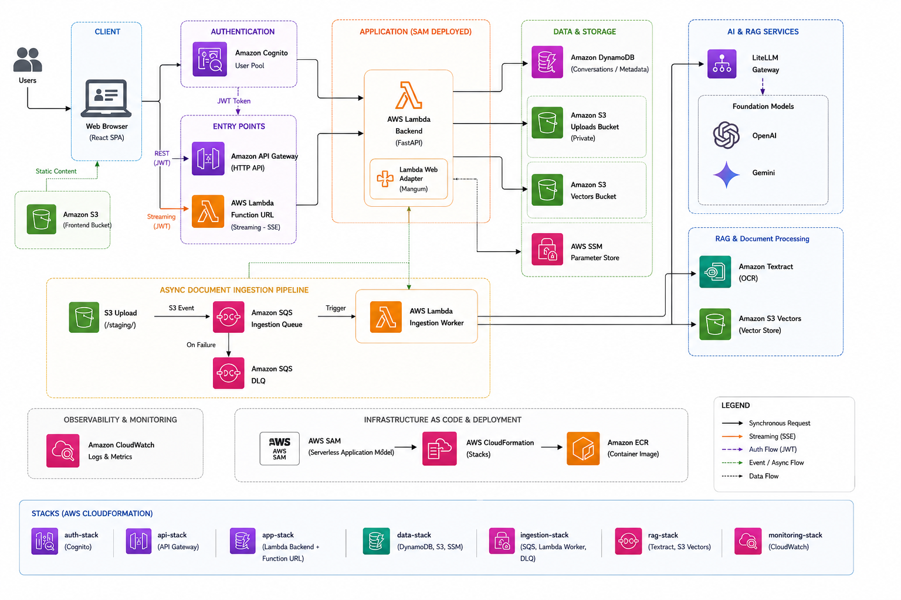
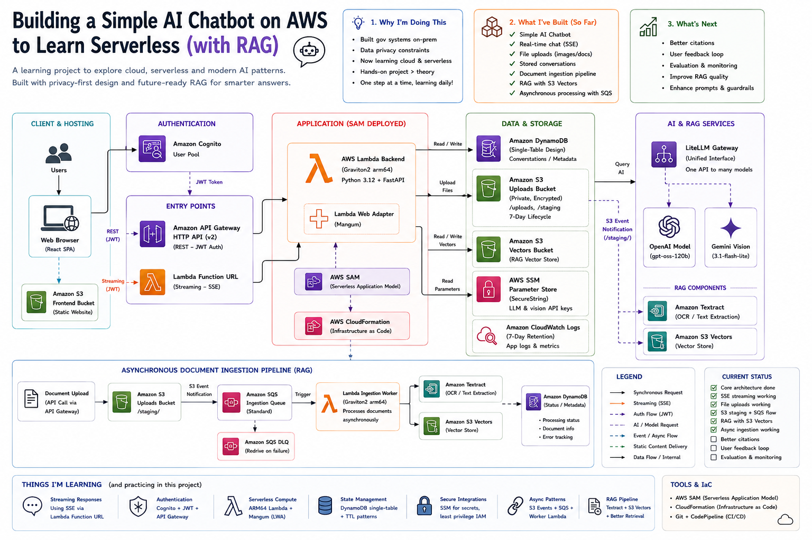
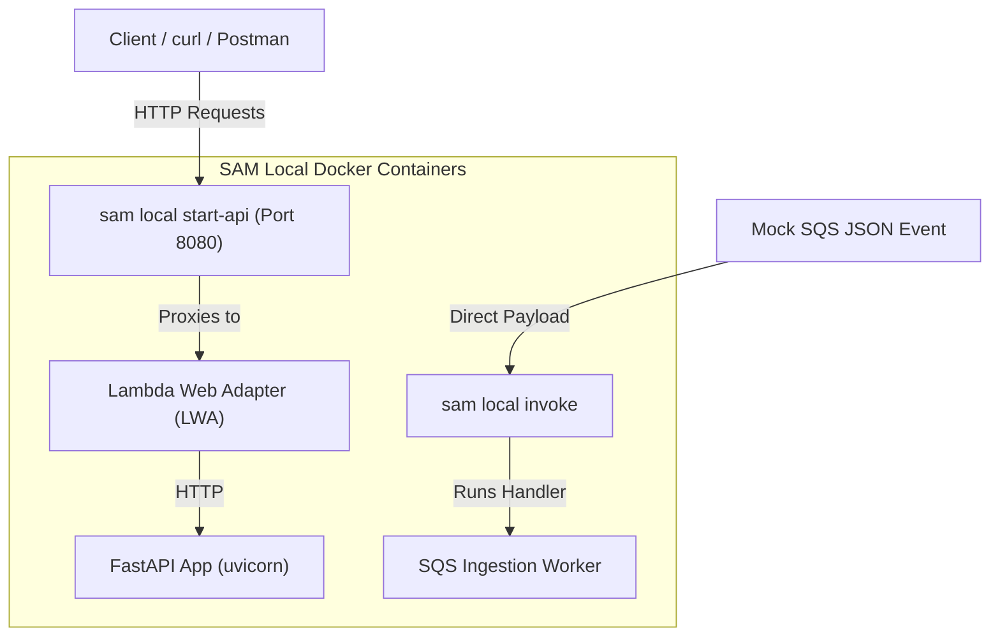

# Master Serverless & RAG Platform Architecture Blueprint on AWS

This document serves as the comprehensive architectural blueprint and implementation manual for the **Serverless Corporate Chatbot and RAG (Retrieval-Augmented Generation) Platform**. It synthesizes high-level service guides, low-level CloudFormation infrastructure declarations (`template.yaml`), and local testing strategies into a single, cohesive developer guide.

---

## 1. Executive Architectural Overview

The entire platform is built with a serverless-first philosophy, ensuring **high scalability, zero idle compute charges, and minimal maintenance overhead**. The platform decouples synchronous, real-time user chat interactions from heavy, compute-intensive document parsing and vector indexing workloads.

### 1.1 Core System Architecture Diagrams

Below are the visual reference diagrams outlining both the high-level system boundaries and the detailed event-driven data flow.

#### High-Level System Architecture


#### Detailed Event-Driven Ingestion & Vector Search Pipeline


---

## 2. End-to-End Logical Flows

When a user interacts with the system, their requests traverse distinct pathways depending on the operation:

### Flow A: Real-Time response Streaming (`POST /chat/stream`)
1. **Request Ingress**: The client initiates an HTTP POST request targeting the **AWS Lambda Function URL (FURL)** instead of API Gateway.
2. **Security Verification**: The FastAPI application performs asymmetric offline validation of the Cognito JWT token in the `Authorization` header.
3. **Retrieval (RAG)**: If vector retrieval is enabled, the backend queries the **Amazon S3 Vectors Index** scoped by `user_id` to gather relevant chunks.
4. **Context Loading**: The backend reads the conversation’s sliding history from the `CTX` cache in **DynamoDB**.
5. **Streaming Execution**: FastAPI initiates `astream()` using **LiteLLM**. The native **AWS Lambda Web Adapter (LWA)** layer (operating in `response_stream` mode) intercepts the ASGI chunk stream and flushes it chunk-by-chunk directly to the open TCP socket.
6. **Persistence**: Once the LLM completes, the assistant's message is persisted to DynamoDB, the context window is updated, and a final `[DONE]` signal is sent to the client.

### Flow B: Decoupled Asynchronous Document Ingestion
1. **Upload Initiation**: The client sends a multipart file upload to API Gateway.
2. **Immediate Acknowledgment**: The backend FastAPI Lambda registers the document metadata in DynamoDB as `processing`, uploads the file bytes to the private **Amazon S3 bucket** under the `staging/` prefix, and immediately returns a `202 Accepted` response.
3. **Event Notification**: S3 publishes an `ObjectCreated` event to the **Amazon SQS Ingestion Queue**.
4. **Worker Activation**: The **Asynchronous Ingestion Worker Lambda** is triggered by SQS (`BatchSize: 1`).
5. **Text Extraction**: The worker downloads the file. If it's a binary (PDF/Image), it polls **AWS Textract** for layout-aware text detection; if it's text (TXT/MD), it decodes it directly.
6. **Embeddings & Vector Indexing**: The text is chunked, converted to 768-dimensional dense vectors via LiteLLM embeddings, and indexed into the **Amazon S3 Vectors** store.
7. **Status Update**: The worker updates the document status to `ready` (or `failed`) in DynamoDB and purges the temporary staging object from S3.

---

## 3. Comprehensive AWS Service Directory

Below is a deep-dive analysis of the 12 primary AWS services orchestrating this stack, balancing conceptual analogies with low-level template settings.

| Service | Role in the Platform | SAM Configuration & Execution Details | Cost-Saving / Free Tier Strategies |
| :--- | :--- | :--- | :--- |
| **AWS Lambda** | Main compute engine for backend FastAPI and SQS Worker. | Graviton `arm64` runtime, Python 3.12, timeouts (30s API, 120s Worker), Memory (512MB). | 1 Million free requests/month. Explicit 7-day log retention configured to avoid endless storage fees. |
| **Amazon API Gateway v2** | Edge gateway for transactional REST endpoints. | HTTP API v2 with global CORS and edge-level Cognito JWT Authorizer. | 1 Million free requests/month. 70% cheaper than traditional REST APIs (v1). CORS handled at edge. |
| **Lambda Function URLs (FURLs)** | High-speed route for real-time response streaming. | `AuthType: NONE`, `InvokeMode: RESPONSE_STREAM`, custom FastAPI PyJWT middleware validation. | Fully free; bypasses API Gateway's 30s timeout and response buffering limits entirely. |
| **AWS Lambda Web Adapter (LWA)** | Integrates standard ASGI servers inside Lambda. | Layer `LambdaAdapterLayerArm64` wrapping `uvicorn` server listening on port 8080. | Brings Time-to-First-Byte (TTFB) down to ~250ms via HTTP chunked transfer encoding. |
| **Amazon Cognito** | Secure user registration and session management. | User Pool directory, User Pool Client (no secret for SPAs), Email verification, password policies. | Keep plan set to **Lite/Essentials** (50,000 free MAUs). Avoid advanced threat security/SMS triggers. |
| **Amazon DynamoDB** | Single-table NoSQL transaction storage. | Partition Key (`pk`), Sort Key (`sk`), `UserConversationsIndex` GSI, and automated native `ttl`. | Configured with **Provisioned Billing** (5 RCU / 5 WCU) to fit 100% inside AWS's Always Free tier. |
| **Amazon S3 (Private)** | Private storage for uploads and vectors. | Private access blocks, Lifecycle Rule (7-day temporary expiry), staging notification triggers. | 5 GB free storage. Temporary uploads automatically purged to prevent long-term storage leakage. |
| **Amazon S3 (Public)** | Hosting static compiled client SPA assets. | S3 Static Website Configuration with `index.html` fallback mapped to handle React SPA router. | Pennies per month. Serves static bundles instantly. In production, front with CloudFront CDN. |
| **AWS SSM Parameter Store** | Encrypted storage of LLM provider keys. | SecureString references (`/chatbot/litellm_api_key`) decrypted at Lambda cold start via Boto3. | Completely free for standard parameters (unlike AWS Secrets Manager which costs $0.40/secret/month). |
| **Amazon CloudWatch Logs** | Diagnostic log groups for debugging. | Configured as custom SAM resources bounded by explicit 7-day log retention limits. | Free tier includes 5 GB of log ingestion/storage. 7-day retention prevents runaway bills. |
| **Amazon S3 Vectors** | Fully native serverless vector search database. | Specialized bucket index containing dense 768-dim embeddings generated via Gemini embeddings. | Serverless indexing; scales to zero. Bypasses running database clusters ($30-$100/month). |
| **AWS Textract** | Structural document layouts parsing. | Asymmetric layout and text extraction for multi-page documents (PDFs, TIFFs, PNGs). | 1,000 pages free/month. Use standard text detection instead of expensive layout tables analysis. |
| **Amazon SQS & DLQ** | Asynchronous job buffer and retry engine. | `IngestionQueue` visibility (180s), Redrive policy pointing to `IngestionDLQ` (14-day retention). | 1 Million free messages/month. Prevents lost uploads and shields worker Lambda from concurrency spikes. |

---

## 4. Low-Level Infrastructure Spec & Template Analysis

The core coordination of this stack resides in `template.yaml`. Key sections are analyzed below:

### 4.1 Global Function Settings
All Lambda functions inherit settings from the `Globals` block:
```yaml
Globals:
  Function:
    Timeout: 30
    MemorySize: 512
    Runtime: python3.12
    Architectures:
      - arm64
```
- **Graviton arm64**: Compiles code for ARM architecture, resulting in a **20% cost reduction** and higher performance compared to x86.
- **512 MB Memory**: Allocates enough memory to prevent CPU throttling during intense Python cold starts and Textract payload decoding.

### 4.2 SQS & Worker Timeout Alignment
A critical serverless pattern is matching SQS visibility timeouts to Lambda execution limits:
- **`ChatbotIngestionWorkerFunction` Timeout**: `120 seconds` (gives Textract and LiteLLM embeddings plenty of time to process large files).
- **`IngestionQueue` VisibilityTimeout**: `180 seconds` (1.5x of the worker timeout).
> [!IMPORTANT]
> If SQS visibility was set to less than 120s (e.g., 30s), SQS would assume the active worker died while processing a long PDF and release the message to a duplicate worker. This would trigger duplicate processing, race conditions in the S3 Vector index, and double LLM billing.

### 4.3 Least-Privilege IAM Policies
Instead of dangerous wildcard permissions (`Resource: "*"`), the backend functions utilize strict AWS-scoped policies:
```yaml
Policies:
  - DynamoDBCrudPolicy:
      TableName: !Ref ChatbotTable
  - S3CrudPolicy:
      BucketName: !Ref ChatbotStorageBucket
  - SSMParameterReadPolicy:
      ParameterName: chatbot/litellm_api_key
```
This isolates the function's execution role to only read/write files in its designated S3 bucket, query its own DynamoDB table, and decrypt its specific SSM parameter.

---

## 5. Single-Table DynamoDB Schema

All persistent data is structured within a single DynamoDB table to bypass costly table-join operations.

```
+------------------------+-----------------------+---------------------------------------+
| Item Type              | Partition Key (pk)    | Sort Key (sk)                         |
+------------------------+-----------------------+---------------------------------------+
| Conversation Metadata  | CONV#<id>             | META                                  |
| Conversation Messages  | CONV#<id>             | MSG#<timestamp>#<message_id>          |
| Sliding Cache Context  | CONV#<id>             | CTX                                   |
| RAG Document Catalog   | USER#<user_id>        | DOC#<document_id>                     |
+------------------------+-----------------------+---------------------------------------+
```

- **Metadata + Messages Pre-Join**: Querying `pk = CONV#<id>` retrieves the conversation metadata, historical message log, and sliding context cache in a **single round-trip query** because they are stored on the same physical partition.
- **User-Level Queries via GSI**: A Global Secondary Index (`UserConversationsIndex`) is mapped with `user_id` as the partition key and `sk` as the sort key, facilitating instantaneous, sorted session listings for any user without slow table scans.
- **Automatic TTL Cache Purging**: The `CTX` sliding window item contains a `ttl` epoch timestamp (1 hour). DynamoDB's background scanner automatically deletes expired cache records, ensuring no storage fees build up for inactive sessions.

---

## 6. Local Emulation, Testing & Debugging

The **AWS SAM CLI** emulates the CloudFormation ecosystem locally using Docker container runtimes.



### 6.1 Steps to Test Locally

#### 1. Export Requirements & Compile Build
Because the project uses `uv`, we export the lock file to a standard `requirements.txt` which SAM builder expects, then build the template:
```bash
cd backend
uv export --format requirements-txt --no-hashes --no-emit-project -o requirements.txt
cd ..
sam build --use-container
```

#### 2. Configure Local Environment Variables
Create an `env.json` file in your root to inject configurations into local containers:
```json
{
  "ChatbotBackendFunction": {
    "Environment": "dev",
    "DYNAMODB_TABLE_NAME": "chatbot-table-dev",
    "S3_BUCKET_NAME": "chatbot-uploads-dev",
    "LITELLM_MODEL": "openai/gpt-4o-mini",
    "LITELLM_API_KEY": "your-api-key-here",
    "LOG_LEVEL": "DEBUG"
  },
  "ChatbotIngestionWorkerFunction": {
    "Environment": "dev",
    "DYNAMODB_TABLE_NAME": "chatbot-table-dev",
    "S3_BUCKET_NAME": "chatbot-uploads-dev",
    "LITELLM_EMBEDDING_MODEL": "gemini/gemini-embedding-2",
    "LITELLM_API_KEY": "your-api-key-here",
    "LOG_LEVEL": "DEBUG"
  }
}
```

#### 3. Emulate API Gateway
```bash
sam local start-api --env-vars env.json --port 8080
```
- Open Swagger Docs: `http://localhost:8080/docs`
- Health check: `curl http://localhost:8080/health`

#### 4. Invoke Worker with a Mock Event
Create a mock event payload file `events/sqs-s3-event.json` containing an S3 staging file pointer:
```json
{
  "Records": [
    {
      "messageId": "msg-12345",
      "body": "{\n  \"Records\": [\n    {\n      \"eventName\": \"ObjectCreated:Put\",\n      \"s3\": {\n        \"bucket\": { \"name\": \"chatbot-uploads-dev\" },\n        \"object\": { \"key\": \"staging/tester/doc123/sample_report.txt\" }\n      }\n    }\n  ]\n}",
      "eventSource": "aws:sqs"
    }
  ]
}
```
Invoke the worker container directly:
```bash
sam local invoke ChatbotIngestionWorkerFunction --event events/sqs-s3-event.json --env-vars env.json
```

#### 5. Network Bridging to Local Databases
If running DynamoDB Local or Minio inside a custom docker-compose network (e.g. `chatbot-network`):
1. Launch SAM inside the same network:
   ```bash
   sam local start-api --env-vars env.json --port 8080 --docker-network chatbot-network
   ```
2. Configure container endpoints in `env.json`:
   ```json
   "DYNAMODB_ENDPOINT_URL": "http://dynamodb-local:8000",
   "S3_ENDPOINT_URL": "http://minio-s3:9000",
   "S3_FORCE_PATH_STYLE": "true"
   ```

---

## 7. Critical Architectural Trade-Offs

### 7.1 Lambda Function URLs (FURLs) vs. API Gateway HTTP APIs
- **Timeout Restrictions**: API Gateway enforces a strict **30-second execution limit** which cannot be raised. Long-running LLM generation requests would easily get cut off. FURLs support execution up to the Lambda hard limit of **15 minutes**.
- **Buffering vs. Streaming**: API Gateway strictly buffers the full REST response, defeating real-time streaming user interfaces. FURLs (configured with `InvokeMode: RESPONSE_STREAM`) flush SSE chunks to the TCP socket instantaneously.
- **Trade-off Decision**: Standard metadata/CRUD traffic utilizes API Gateway to leverage native **Cognito edge authorization**. Streaming/Chat traffic utilizes Function URLs to leverage **direct, unbuffered Response Streaming**.

### 7.2 Amazon S3 Vectors vs. Dedicated Vector Database Clusters
- **Traditional Approach**: Running dedicated database clusters (like Pinecone, Qdrant, or RDS pgvector) provides advanced, multi-attribute complex filtering, but introduces a massive baseline cost of **$30 to $100+/month** regardless of usage.
- **S3 Vectors Approach**: Storing high-dimensional dense coordinate arrays directly in indexed S3 buckets scales to **exactly $0/month** when idle.
- **Trade-off Decision**: Amazon S3 Vectors was selected to maintain the platform's **100% serverless, zero-maintenance, and ultra-low-cost billing profile** while still delivering fast similarity search capabilities.

### 7.3 Asynchronous Ingestion (SQS) vs. Synchronous API Imports
- **Synchronous Approach**: Parsing documents inside the `POST` handler blocks the thread, forcing the user's browser to wait up to minutes while Textract reads pages, LiteLLM generates embeddings, and the vector index updates. This is highly fragile and vulnerable to 30-second API timeouts.
- **Asynchronous Approach (SQS)**: The upload API saves the file and returns instantly (`202 Accepted`). The SQS queue guarantees the processing job is saved and processed out-of-band by the Worker Lambda.
- **Trade-off Decision**: The asynchronous queue-centric pipeline was selected to maximize **system reliability, UI responsiveness, and processing fault tolerance**.
