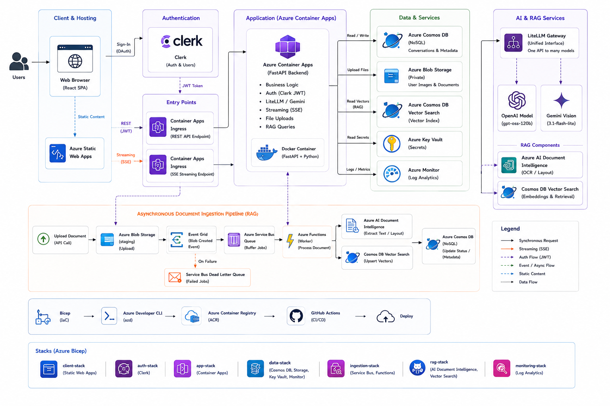
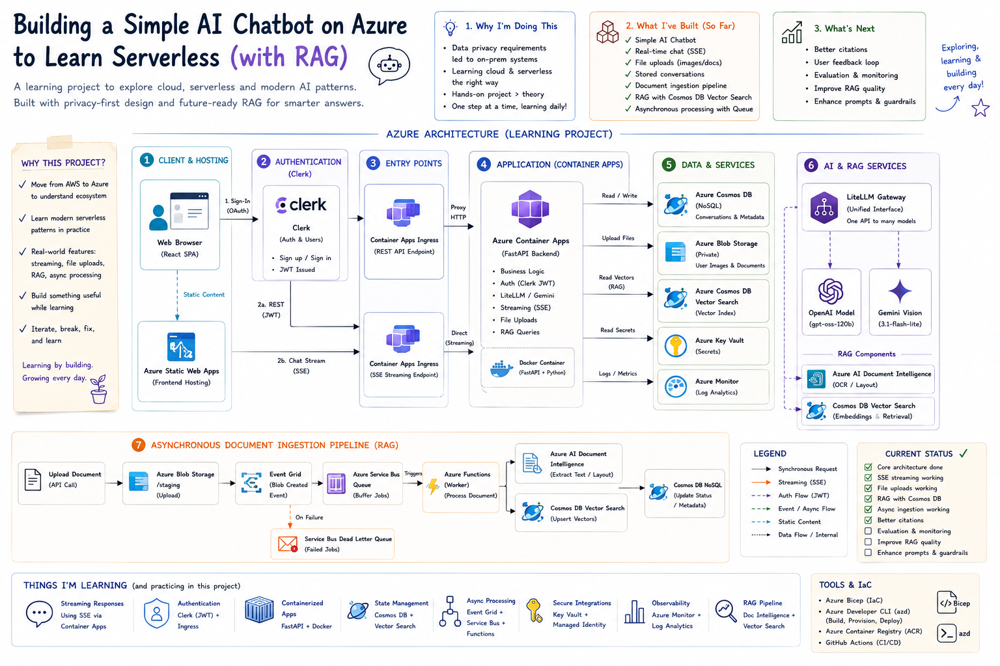
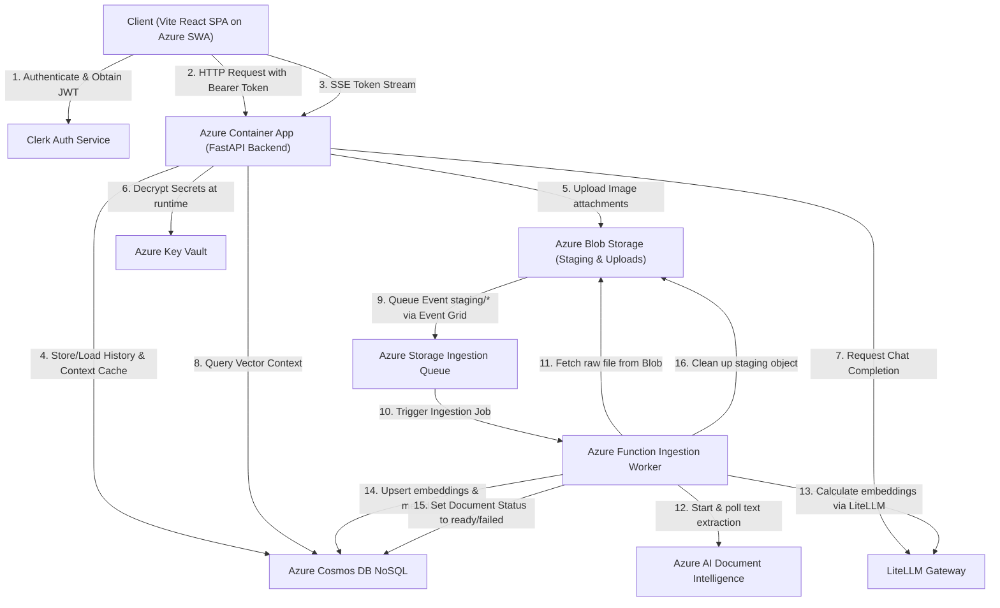
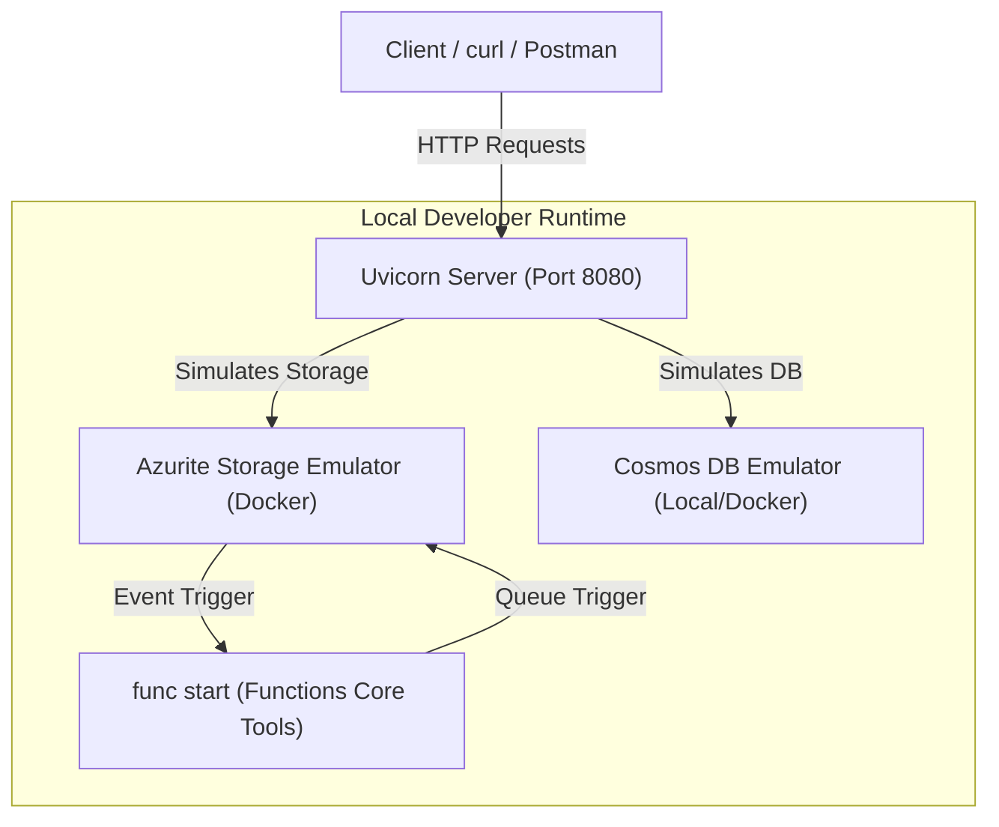

# Master Serverless & RAG Platform Architecture Blueprint on Azure

This document serves as the comprehensive architectural blueprint and implementation manual for the **Serverless Corporate Chatbot and RAG (Retrieval-Augmented Generation) Platform** on Microsoft Azure. It synthesizes high-level service guides, low-level Bicep infrastructure declarations (`main.bicep` and modules), and local testing strategies into a single, cohesive developer guide.

---

## 1. Executive Architectural Overview

The entire platform is built with a serverless-first philosophy, ensuring **high scalability, zero idle compute charges, and minimal maintenance overhead**. The platform decouples synchronous, real-time user chat interactions from heavy, compute-intensive document parsing and vector indexing workloads.

### 1.1 Core System Architecture Diagrams

Below are the visual reference diagrams outlining both the high-level system boundaries and the detailed event-driven data flow.

#### High-Level System Architecture



#### Detailed Event-Driven Ingestion & Vector Search Pipeline



#### Interactive Mermaid Flowchart of Request and Ingestion Flows



---

## 2. End-to-End Logical Flows

When a user interacts with the system, their requests traverse distinct pathways depending on the operation:

### Flow A: Real-Time Response Streaming (`POST /chat/stream`)

1. **Request Ingress**: The client initiates an HTTP POST request targeting the **Azure Container Apps (ACA)** public ingress endpoint.
2. **Security Verification**: The FastAPI application performs asymmetric OIDC validation of the Clerk JWT token in the `Authorization` header against Clerk's JWKS endpoint.
3. **Retrieval (RAG)**: If vector retrieval is enabled, the backend queries the **Azure Cosmos DB Vectors** container (`vectors`) scoped by `user_id` using a native `VectorDistance()` query to gather relevant text chunks.
4. **Context Loading**: The backend reads the conversation’s sliding history from the `CTX` cache in the Cosmos DB `conversations` container.
5. **Streaming Execution**: FastAPI initiates `astream()` using **LiteLLM**. Azure Container Apps natively supports HTTP Chunked Transfer Encoding (Response Streaming), allowing the ASGI chunk stream to flush directly to the open TCP socket.
6. **Persistence**: Once the LLM completes, the assistant's message is persisted to the Cosmos DB `conversations` container, the context window is updated, and a final `[DONE]` signal is sent to the client.

### Flow B: Decoupled Asynchronous Document Ingestion

1. **Upload Initiation**: The client sends a multipart file upload to the API `/rag/ingest/file` route.
2. **Immediate Acknowledgment**: The backend FastAPI application registers the document metadata in the Cosmos DB `conversations` container as `processing`, uploads the file bytes to the private **Azure Blob Storage staging container** (`staging`), and immediately returns a `202 Accepted` response.
3. **Event Notification**: Blob Storage publishes a `Microsoft.Storage.BlobCreated` event via an **Azure Event Grid System Topic Subscription** to the **Azure Storage Ingestion Queue** (`ingestion-queue`).
4. **Worker Activation**: The **Asynchronous Ingestion Worker** (an isolated **Azure Function App**) is triggered by the queue trigger when a new message arrives.
5. **Text Extraction**: The worker downloads the file from the staging container. If it's a binary (PDF/Image), it calls the `prebuilt-layout` endpoint of **Azure AI Document Intelligence** and polls it for layout-aware text detection; if it's text (TXT/MD), it decodes it directly.
6. **Embeddings & Vector Indexing**: The text is chunked, converted to 768-dimensional dense vectors via LiteLLM embeddings, and indexed into the Cosmos DB **`vectors`** container.
7. **Status Update**: The worker updates the document status to `ready` (or `failed`) in the Cosmos DB `conversations` container and purges the temporary staging object from Blob Storage.

---

## 3. Comprehensive Azure Service Directory

Below is a deep-dive analysis of the 12 primary Azure services orchestrating this stack, balancing conceptual analogies with low-level Bicep template settings.

| Service | Role in the Platform | Bicep Configuration & Execution Details | Cost-Saving / Free Tier Strategies |
| :--- | :--- | :--- | :--- |
| **Azure Container Apps (ACA)** | Main compute engine for hosting the FastAPI REST API. | Auto-scaling container running in a consumption environment. CPU/Memory set to `0.25 vCPU` and `0.5 GiB` minimum, scaling down to 0 instances when idle. | Scale-to-zero configuration ensures no idle compute charges. First 180,000 vCPU-seconds and 360,000 GiB-seconds free per month. |
| **Azure Static Web Apps (SWA)** | Hosts static compiled React, TypeScript, and CSS assets. | Globally distributed static host. Utilizes `staticwebapp.config.json` for custom fallback routing, headers, and CDN distribution. | Free Tier SKU. Bypasses running dedicated VM/App Service plans, serving web assets via Azure's global CDN for $0. |
| **Azure Functions** | Isolated serverless background queue worker for RAG ingestion. | Consumption-based Serverless Linux app triggered by Azure Storage Queue events (`ingestion-queue`). | 1 Million free executions per month. Functions only run on-demand when documents are uploaded. |
| **Azure Storage Queues** | Decoupled queue for staging document indexing jobs. | `ingestion-queue` queue resource defined inside the Storage Account. Maximum dequeue retry count configured to `3`. | Pay-per-transaction storage queues are extremely cheap (less than $0.05 per million operations). |
| **Azure Blob Storage (Private)** | Private storage for uploads, staging, and temp files. | Storage account with block blob containers (`uploads`, `staging`, `rag-temp`), private access blocks, and lifecycle rule policies. | Lifecycle management policies auto-purge elements under `staging/` and `rag-temp/` prefixes after 7 days to eliminate storage clutter. |
| **Azure Cosmos DB NoSQL** | Stores conversation history, metadata, and document catalogs. | Cosmos DB Account with a single database `chatbot` and a main transactional container `conversations` partitioned by `/conversationId`. | Free Tier (enableFreeTier: true) applies to the Cosmos DB account, providing 1000 RU/s throughput and 25 GB storage 100% free forever. |
| **Azure Cosmos DB Vectors** | Integrated native serverless vector search database. | Dedicated `vectors` container with `/userId` partition key and a `quantizedFlat` vector index configuration on `/embedding`. | Leverages the same Cosmos DB database throughput resource pool. Flat quantization saves memory and search costs. |
| **Azure Key Vault** | Secure encrypted secret store of model API keys and secrets. | Vault instance (`kv-chatbot-<token>`) mapped with role-based policies allowing backend services to read secrets at runtime. | First 10,000 transactions free per month. Eliminates the need to distribute environment variables with raw passwords. |
| **Azure AI Document Intelligence** | Layout-aware OCR document parser. | Cognitive Services resource configured with `prebuilt-layout` models to extract text from multi-page PDFs/images. | Free Tier (F0) provides 500 pages processed per month free of charge. |
| **Azure Event Grid** | System topic and event subscription router. | System Topic subscription mapping `BlobCreated` events from the staging container to the storage ingestion queue. | First 100,000 operations free per month. Bypasses writing custom pollers or cron jobs to scan blob containers. |
| **Azure Monitor & App Insights** | Centrally logs traces, exceptions, and server metrics. | Log Analytics Workspace tied to Application Insights, capturing FastAPI logs and Function worker stdout. | 5 GB data ingestion free per month. Retains logs for 30 days by default (fits within the free tier). |
| **Clerk Authentication** | Third-party user identity management (OIDC). | External JWKS directory validating user identity JWT signatures on backend API routes. | Free tier supports up to 10,000 Monthly Active Users (MAUs). |

---

## 4. Low-Level Bicep Infrastructure Spec & Configurations

The core coordination of the Azure stack resides in `main.bicep` and the `modules/` templates. Key configuration patterns are analyzed below:

### 4.1 Consumption Profile Configuration

To keep the application serverless and low-cost, the compute resources utilize consumption settings:

* **Azure Container App resources** (in [container-apps.bicep](file:///Users/hari/Desktop/sandbox/chatbot-azure/infra/modules/container-apps.bicep)):
  ```bicep
  resources: {
    cpu: json('0.25')
    memory: '0.5Gi'
  }
  scale: {
    minReplicas: 0
    maxReplicas: 10
  }
  ```
  This scale-to-zero policy prevents billing during periods of inactivity.

* **Azure Functions** (in [functions.bicep](file:///Users/hari/Desktop/sandbox/chatbot-azure/infra/modules/functions.bicep)):
  Configured to run on the Serverless **Consumption Plan (Y1)**, charging only for resources consumed during function execution.

### 4.2 Storage Queue & Function Worker Timeout Alignment

Azure Functions Core tools and the runtime are configured to handle ingestion gracefully:
* **Function App Timeout**: The default execution timeout for Consumption Plan functions is `5 minutes` (300s), which can be increased to `10 minutes` (600s) inside `host.json`. This provides ample time for Azure AI Document Intelligence layouts and LiteLLM embeddings to process large documents.
* **Storage Queue Message TTL & Redrive**: Configured via Event Grid subscription with a Time-to-Live of 14 days. If the function worker fails 3 consecutive times (determined by `maxDequeueCount: '3'` on the queue), Cosmos DB logs the RAG document state as `failed`, preventing poison messages from looping infinitely and running up API costs.

### 4.3 Least-Privilege IAM & Role-Based Access Control (RBAC)

The application utilizes **System-Assigned Managed Identity** for authentication. There are no stored passwords or connection strings in the container configurations. Azure Bicep sets up role assignments dynamically:

```bicep
// Cosmos DB Built-in Data Contributor Role Assignment
resource cosmosRoleAssignment 'Microsoft.DocumentDB/databaseAccounts/sqlRoleAssignments@2024-05-15' = {
  parent: cosmosAccount
  name: guid(cosmosAccount.id, containerAppPrincipalId, 'CosmosDbContributor')
  properties: {
    roleDefinitionId: subscriptionResourceId('Microsoft.DocumentDB/databaseAccounts/sqlRoleDefinitions', cosmosAccount.name, '00000000-0000-0000-0000-000000000002')
    principalId: containerAppPrincipalId
    scope: cosmosAccount.id
  }
}
```

Other key assignments configured in [keyvault.bicep](file:///Users/hari/Desktop/sandbox/chatbot-azure/infra/modules/keyvault.bicep):
* **Key Vault Secrets User** is assigned to both the ACA and Function App identities.
* **Storage Blob Data Contributor** is assigned to the API and Function App identities to read/write raw uploads and staging binaries.

---

## 5. Single-Container Cosmos DB Data Model

To optimize database lookups and fit completely within the Cosmos DB Free Tier, the conversation history is modeled inside a single container (`conversations`) utilizing a Cosmos-friendly replica of the Single-Table design pattern:

```
+------------------------+---------------------------------------+-----------------------------+---------+
| Item Type              | id (Cosmos Unique Identifier)         | Partition Key (pk / convId) | sk      |
+------------------------+---------------------------------------+-----------------------------+---------+
| Conversation Metadata  | <convId>_META                         | <convId>                    | META    |
| Conversation Messages  | <convId>_MSG_<messageId>              | <convId>                    | MSG#... |
| Sliding Cache Context  | <convId>_CTX                          | <convId>                    | CTX     |
| RAG Document Catalog   | <userId>_RAGDOC_<docId>               | _user_<userId>              | RAGDOC# |
+------------------------+---------------------------------------+-----------------------------+---------+
```

* **Data Partitioning**: The Cosmos DB partition key is `/conversationId`. For a specific conversation, metadata, message items, and context items all share the exact same partition key. Querying `SELECT * FROM c WHERE c.conversationId = @convId` returns the full session state in a single, fast request.
* **RAG Document Catalog isolation**: Documents are written with partition key `_user_<userId>`, allowing efficient listing of a single user's documents (`list_rag_documents`) in a localized query partition.
* **Sliding Context Cache**: The `CTX` item stores a JSON array of the last `N` messages in the conversation. When starting a chat stream, the backend immediately performs a point read of `<convId>_CTX` (which uses only 1 RU) to retrieve the sliding context, avoiding historical database scans.

---

## 6. Local Emulation, Testing & Debugging

For offline testing, the system provides mock modules and integrates with local emulator environments.



### 6.1 Steps to Test Locally

#### 1. Setup Local Environment Variables
Configure the backend `.env` file with your local credentials and model keys.
```ini
COSMOS_ENDPOINT=https://localhost:8081
AZURE_STORAGE_CONNECTION_STRING=UseDevelopmentStorage=true
LITELLM_API_KEY=your-api-key-here
```

#### 2. Run Local Emulators
Run **Azurite** and the **Cosmos DB Emulator** in Docker:
```bash
# Start Azurite Storage Emulator
docker run -p 10000:10000 -p 10001:10001 -p 10002:10002 mcr.microsoft.com/azure-storage/azurite

# Start Azure Cosmos DB Emulator (Linux/Docker version)
docker run -p 8081:8081 -p 10255:10255 mcr.microsoft.com/cosmosdb/linux/azure-cosmos-emulator
```

#### 3. Run FastAPI Backend
Launch the backend server:
```bash
cd backend
uv venv
source .venv/bin/activate
uv pip install -r requirements.txt
uv run uvicorn app.main:app --reload --port 8080
```
Open interactive Swagger documentation at `http://localhost:8080/docs`.

#### 4. Run Ingestion Worker Function App
Launch the Azure Functions app locally using Azure Functions Core Tools:
```bash
cd backend
func start
```

---

## 7. Critical Architectural Trade-Offs

### 7.1 Azure Container Apps Ingress vs. Azure API Management (APIM)

* **Timeout Restrictions**: Azure API Management (APIM) enforces gateway timeout rules and can introduce proxy overhead for streaming response payloads. 
* **Streaming Support**: By routing traffic directly through Azure Container Apps (ACA) Ingress, the application leverages ACA's native support for HTTP chunked transfer encoding (SSE). This keeps latency low and ensures long-running token streaming is not cut off by intermediate proxy timeouts.
* **Trade-off Decision**: Trailing directly into ACA Ingress was selected for all routes, relying on FastAPI custom OIDC JWT middleware validation to handle security without incurring the costs ($30+/month) and configuration overhead of APIM.

### 7.2 Cosmos DB NoSQL Vector Search vs. Dedicated Vector Databases (e.g. Qdrant / Pinecone)

* **Baseline Cost**: Running dedicated clusters for Qdrant or Pinecone introduces an idle cost of **$30 to $100+/month**.
* **Cosmos DB Vector Search**: By using native vector indexing inside Cosmos DB, vectors are stored in the same database engine as the conversation metadata. It leverages Cosmos DB's Free Tier, scaling down to **$0/month** when idle.
* **Trade-off Decision**: Native Cosmos DB Vector Search was selected to keep the platform **100% serverless, zero-maintenance, and cost-effective**, while enabling single-query metadata-filtered vector searches.

### 7.3 Asynchronous Ingestion (Event Grid + Storage Queue) vs. Synchronous API Ingestion

* **Synchronous Approach**: Parsing layout directories, splitting text, generating embeddings, and updating index vectors synchronously inside the REST endpoint thread blocks client connections, running up against timeouts and degrading user experience.
* **Asynchronous Queue Approach**: FastAPI saves the file and returns `202 Accepted` immediately. Event Grid routes the upload event to `ingestion-queue`. The Azure Function worker handles layout parsing and embeddings generation out-of-band.
* **Trade-off Decision**: The asynchronous queue-centric pipeline was selected to maximize **UI responsiveness, processing reliability, and system fault tolerance**.
