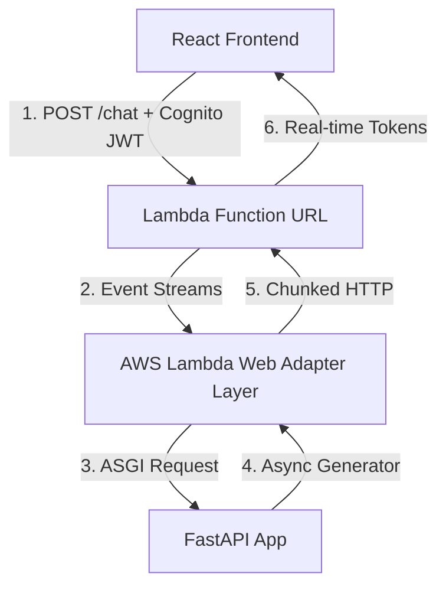

# Implementing Server-Sent Events (SSE) Response Streaming in AWS Serverless

This document outlines the architectural changes, code implementation, infrastructure requirements, and cost/performance impacts of transitioning the chatbot application from a synchronous JSON request/response flow to real-time **Server-Sent Events (SSE) streaming**.

---

## 1. Architectural Overview & Comparison

In our current synchronous setup, the frontend sends a prompt, and the backend waits for the full response from the LLM before replying. In the proposed streaming architecture, responses are delivered chunk-by-chunk in real-time.

### Comparison Table

| Feature                       | Current Synchronous JSON                     | Proposed SSE Streaming                       |
| :---------------------------- | :------------------------------------------- | :------------------------------------------- |
| **Response Format**           | `application/json`                           | `text/event-stream`                          |
| **Time-to-First-Byte (TTFB)** | High (5–12 seconds, dependent on LLM length) | Ultra-Low (200–500ms, instant token display) |
| **Gateway Integration**       | API Gateway HTTP API v2                      | Lambda Function URL (FURL)                   |
| **Lambda Adapter**            | Mangum (ASGI-to-Lambda)                      | AWS Lambda Web Adapter (LWA)                 |
| **Authentication**            | API Gateway Cognito Authorizer               | In-App FastAPI JWT Dependency                |
| **Cost**                      | API Gateway Request + Lambda Duration        | Lambda Duration Only (FURL is free)          |

### Real-Time Flow Comparison

#### Current Setup (Synchronous Buffer)

```txt
[React Frontend] --- (POST /chat) ---> [API Gateway HTTP API] ---> [FastAPI + Mangum]
                                                                        |
                                                                  (Await completion)
                                                                        |
[React Frontend] <--- (JSON Response) <--- [API Gateway HTTP API] <--- [FastAPI App]
```

#### Proposed Setup (Active Chunk Stream)



---

## 2. Infrastructure Changes (`template.yaml`)

To support true response streaming, we must address two limitations in our current stack:

1. **API Gateway HTTP APIs (v2)** do not support chunked/streaming responses. They buffer all responses.
2. **Mangum** lacks native support for chunked response streaming in Lambda environments.

### The Solution: Lambda Function URLs & AWS Lambda Web Adapter (LWA)

We will deploy a **Lambda Function URL** with `RESPONSE_STREAM` invocation mode and bundle **LWA** as an execution layer. LWA translates standard FastAPI/Uvicorn `StreamingResponse` events into the streaming format expected by Lambda.

Here are the required changes in `template.yaml`:

```yaml
# 1. Modify the ChatbotBackendFunction Resource to include the LWA Layer
ChatbotBackendFunction:
  Type: AWS::Serverless::Function
  Properties:
    CodeUri: ./backend
    # Set Handler to run.sh so that the LWA execution wrapper executes it at startup
    Handler: run.sh
    Layers:
      # Add AWS Lambda Web Adapter Layer (verify regional ARN)
      - !Sub arn:aws:lambda:${AWS::Region}:753240598075:layer:LambdaAdapterLayerArm64:27
    Environment:
      Variables:
        # Enable response streaming mode in LWA
        AWS_LAMBDA_EXEC_WRAPPER: /opt/bootstrap
        AWS_LWA_INVOKE_MODE: response_stream
        PORT: "8080"
        # Database & Model variables remain the same...

    # 2. Expose the Lambda Function URL with Response Streaming Mode enabled
    FunctionUrlConfig:
      AuthType: NONE # Managed inside the FastAPI app using JWT validation
      InvokeMode: RESPONSE_STREAM
      # Note: We delegate CORS entirely to FastAPI (using CORSMiddleware in main.py)
      # instead of configuring it here. This avoids duplicate CORS headers
      # (e.g. Access-Control-Allow-Origin) which would cause the browser to block calls.
```

## 3. Backend Changes (FastAPI)

Currently, the chat endpoint blocks on LLM invocation and writes the final response immediately. In a streaming setup, the database writes must be deferred until the end of the stream generator.

### `backend/app/api/routes.py` (Proposed Streaming Implementation)

```python
import json
import logging
from fastapi import APIRouter, Depends, HTTPException, status
from fastapi.responses import StreamingResponse
from uuid import uuid4
from datetime import timedelta
from ..dependencies import get_llm_client, get_repository, get_settings, get_current_user_id
from ..utils.time import to_epoch_seconds, utcnow, utcnow_iso

logger = logging.getLogger(__name__)
router = APIRouter()

@router.post("/chat/stream")
async def chat_stream(
    payload: ChatRequest,
    repo=Depends(get_repository),
    settings=Depends(get_settings),
    llm=Depends(get_llm_client),
    user_id: str = Depends(get_current_user_id), # Custom Cognito JWT validator
) -> StreamingResponse:
    conversation_id = payload.conversation_id or str(uuid4())
    user_message_id = str(uuid4())
    assistant_message_id = str(uuid4())
    created_at = utcnow_iso()

    # 1. Immediately log conversation metadata and store the User prompt in DynamoDB
    conv_name = payload.message[:30] + "..." if len(payload.message) > 30 else payload.message
    await to_thread.run_sync(
        repo.create_conversation, conversation_id, created_at, user_id, conv_name
    )
    await to_thread.run_sync(
        repo.put_message, conversation_id, user_message_id, "user", payload.message, created_at, None, user_id
    )

    # 2. Load context history for LiteLLM
    history = await _load_history(repo, conversation_id, settings.max_history_messages)
    messages = build_history_messages(history)
    messages.append({"role": "user", "content": payload.message})

    # 3. Stream Generator
    async def token_generator():
        accumulated_text = ""
        try:
            # Call streaming method of LiteLLM/OpenAI client
            async for chunk in await llm.astream(messages):
                token = chunk.choices[0].delta.content or ""
                if token:
                    accumulated_text += token
                    # Yield compliant SSE event chunk
                    yield f"data: {json.dumps({'text': token, 'conversation_id': conversation_id})}\n\n"

            # 4. Success: Save compiled Assistant response to database
            assistant_created_at = utcnow_iso()
            await to_thread.run_sync(
                repo.put_message,
                conversation_id,
                assistant_message_id,
                "assistant",
                accumulated_text,
                assistant_created_at,
                None,
                None
            )
            # Update cache context for session tracking
            await _update_context(
                repo,
                conversation_id,
                settings.max_history_messages,
                settings.context_ttl_seconds,
                history,
                payload.message,
                accumulated_text
            )

            # Send close event
            yield "data: [DONE]\n\n"

        except Exception as e:
            logger.exception("Error in LLM stream generator")
            yield f"data: {json.dumps({'error': 'Stream generation interrupted', 'details': str(e)})}\n\n"

    return StreamingResponse(token_generator(), media_type="text/event-stream")
```

---

## 4. Frontend Changes (React)

Since we must send a `POST` request with custom `Authorization` and `Content-Type` headers, native browser `EventSource` cannot be used directly. Instead, we use the browser's standard **Fetch API stream reader**.

### `frontend/src/services/api.ts` (Stream Consumption)

```typescript
export interface StreamChunk {
  text?: string;
  conversation_id?: string;
  error?: string;
}

export async function sendChatMessageStream(
  message: string,
  token: string,
  conversationId?: string,
  onChunk: (text: string) => void,
  onComplete: (finalConversationId: string) => void,
  onError: (error: string) => void,
): Promise<void> {
  try {
    const response = await fetch(
      `${import.meta.env.VITE_API_BASE_URL}/chat/stream`,
      {
        method: "POST",
        headers: {
          "Content-Type": "application/json",
          Authorization: `Bearer ${token}`,
        },
        body: JSON.stringify({
          message,
          conversation_id: conversationId,
        }),
      },
    );

    if (!response.ok) {
      const errorText = await response.text();
      throw new Error(errorText || "Failed to initiate stream");
    }

    const reader = response.body?.getReader();
    const decoder = new TextDecoder("utf-8");
    if (!reader) {
      throw new Error("No stream reader available");
    }

    let buffer = "";
    let activeConversationId = conversationId;

    while (true) {
      const { value, done } = await reader.read();
      if (done) break;

      buffer += decoder.decode(value, { stream: true });
      const lines = buffer.split("\n\n");

      // Save trailing incomplete line back to the buffer
      buffer = lines.pop() || "";

      for (const line of lines) {
        if (!line.trim() || !line.startsWith("data: ")) continue;

        const dataStr = line.replace(/^data:\s*/, "");
        if (dataStr === "[DONE]") continue;

        try {
          const chunk: StreamChunk = JSON.parse(dataStr);
          if (chunk.error) {
            onError(chunk.error);
            return;
          }
          if (chunk.text) {
            onChunk(chunk.text);
          }
          if (chunk.conversation_id) {
            activeConversationId = chunk.conversation_id;
          }
        } catch (e) {
          console.warn("Failed to parse SSE chunk", dataStr, e);
        }
      }
    }

    if (activeConversationId) {
      onComplete(activeConversationId);
    }
  } catch (error: any) {
    onError(error.message || "An unexpected error occurred during streaming");
  }
}
```

---

## 5. Security & Authentication Model

### The Shift from API Gateway Authorizers to FastAPI Middleware

By utilizing Lambda Function URLs, we lose the native Cognito integration built into API Gateway (`ChatbotHttpApi`). Authentication is instead moved directly into the Python application layer.

#### FastAPI JWT Authentication Dependency

In `backend/app/dependencies.py`, we implement a validator that handles the Cognito JWKS key rotation, signature verification, and expiration validation:

```python
import jwt # PyJWT
import requests
from fastapi import Header, HTTPException, status, Depends
from functools import lru_cache

COGNITO_JWKS_URL = "https://cognito-idp.{region}.amazonaws.com/{user_pool_id}/.well-known/jwks.json"

@lru_cache()
def get_jwks(url: str):
    return requests.get(url).json()

async def get_current_user_id(
    authorization: str = Header(..., description="Cognito Bearer Token"),
    settings=Depends(get_settings)
) -> str:
    if not authorization.startswith("Bearer "):
        raise HTTPException(status_code=status.HTTP_401_UNAUTHORIZED, detail="Invalid token scheme")

    token = authorization.split(" ")[1]
    jwks_url = COGNITO_JWKS_URL.format(
        region=settings.aws_region,
        user_pool_id=settings.cognito_user_pool_id
    )

    try:
        # 1. Fetch Cognito Public Keys
        jwks = get_jwks(jwks_url)
        unverified_header = jwt.get_unverified_header(token)
        kid = unverified_header["kid"]

        # 2. Match Key ID
        public_key = None
        for key in jwks["keys"]:
            if key["kid"] == kid:
                public_key = jwt.algorithms.RSAAlgorithm.from_jwk(key)
                break

        if not public_key:
            raise HTTPException(status_code=status.HTTP_401_UNAUTHORIZED, detail="Token key identifier not found")

        # 3. Decode & Verify JWT
        payload = jwt.decode(
            token,
            public_key,
            algorithms=["RS256"],
            audience=settings.cognito_client_id,
            options={"verify_exp": True}
        )

        # 4. Return unique sub / user_id
        return payload["sub"]

    except jwt.ExpiredSignatureError:
        raise HTTPException(status_code=status.HTTP_401_UNAUTHORIZED, detail="Token expired")
    except Exception as e:
        raise HTTPException(status_code=status.HTTP_401_UNAUTHORIZED, detail=f"Invalid credentials: {str(e)}")
```

---

## 6. Performance & Cost Analysis

Transitioning to this streaming model has subtle trade-offs concerning serverless costs and resource management:

### A. Cost Structure: Neutral to Beneficial

1. **Lambda Compute Duration (Direct Neutrality):**
   AWS Lambda is billed in GB-seconds of execution time. If generating a response takes 5 seconds, the Lambda runs for exactly 5 seconds in both architectures. The compute cost remains identical.
2. **API Gateway Elimination (Pure Cost Saving):**
   API Gateway charges per request and per GB transferred. **Lambda Function URLs are completely free of charge.** By routing chat traffic directly through Function URLs, you eliminate API Gateway costs entirely for the conversational endpoints.

### B. User Experience Impact (TTFB)

- **Standard REST/HTTP Payload Response:** A complete 400-word response takes roughly **6.5 seconds** to appear. The user experiences high latency and potential disconnection.
- **Streaming Response:** The first token renders in **250ms**. The subsequent generation updates the UI organically at $\approx 50\text{ tokens/sec}$, providing a vastly superior, modern interactive feeling.

### C. Concurrency Management

Because streaming holds a connection open for the entire duration of the token generation, individual Lambda functions remain active longer.

- **Concurrency Formula:**
  $$\text{Concurrent Executions} = \text{Requests per Second} \times \text{Average Execution Time (Seconds)}$$
- In a synchronous JSON setup, if a quick error occurs, the execution is terminated immediately. In streaming, a client closing their browser tab might keep the stream active on the server unless the connection teardown is handled correctly.
- **Remediation:** In our FastAPI router loop, we handle connection closes proactively using standard HTTP disconnections to interrupt the generator and avoid wasted execution cycles.

---

## Summary of Next Steps for Implementation

To implement SSE streaming in our serverless chatbot environment, follow these phases:

1. **Dependency Addition:** Install `PyJWT` or `python-jose` for JWT validation, and add the `@microsoft/fetch-event-source` package to the frontend (or write a custom chunk decoder).
2. **FastAPI Route Migration:** Introduce `/chat/stream` alongside the current `/chat` endpoint to prevent disruption.
3. **template.yaml Layer Upgrade:** Package AWS Lambda Web Adapter as a Lambda Layer and configure the API with a Function URL in `template.yaml`.
4. **Deploy & Validate:** Perform a `sam deploy` or `just deploy-backend` and test stream parsing on the React client.
